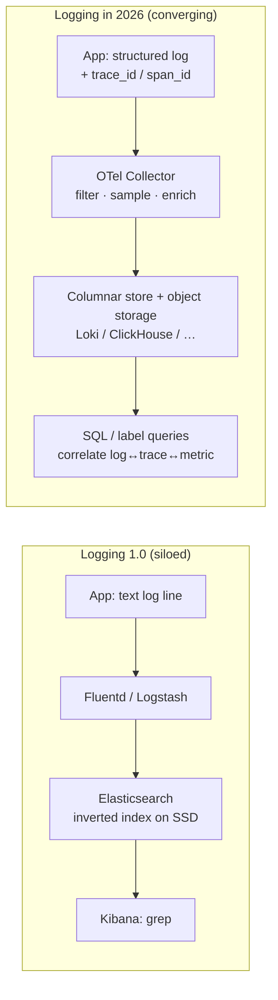
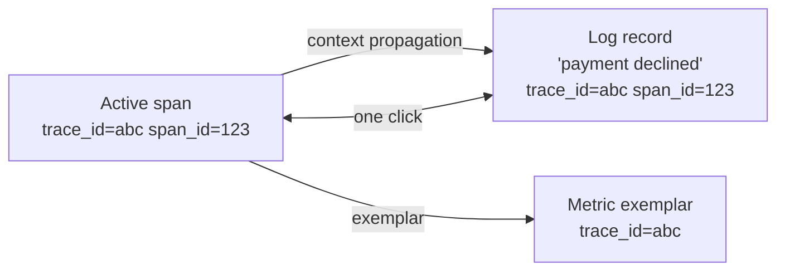
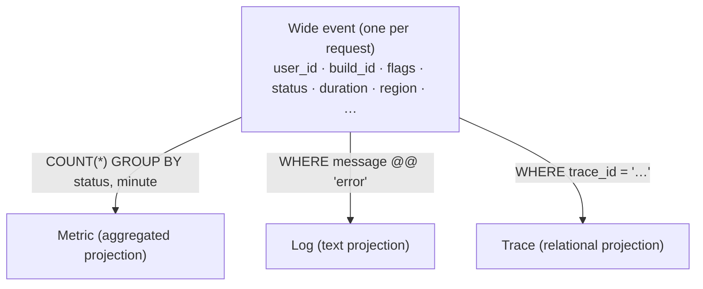
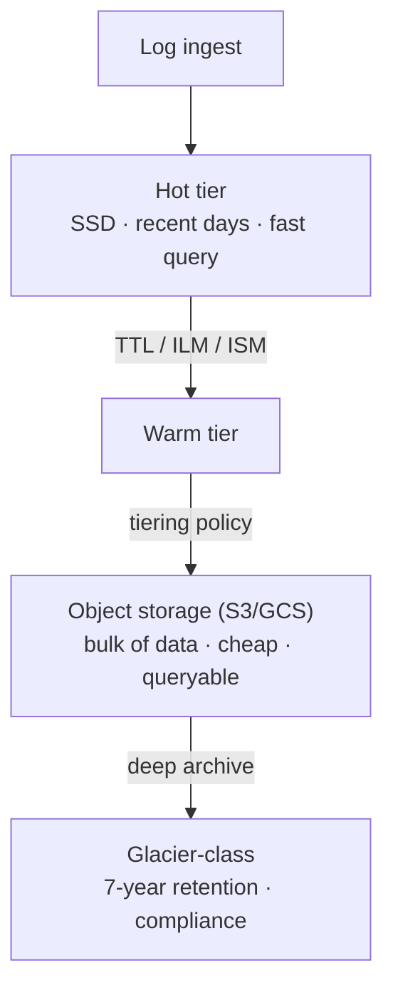
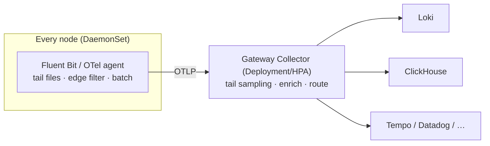
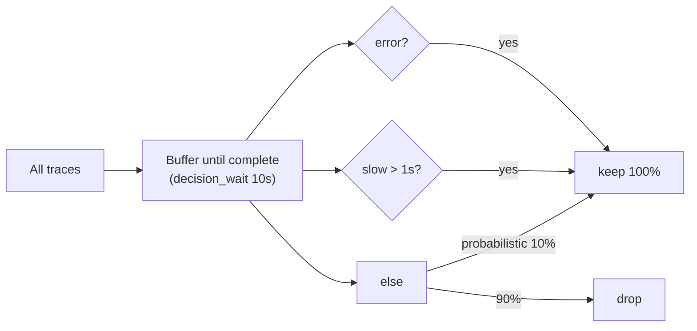
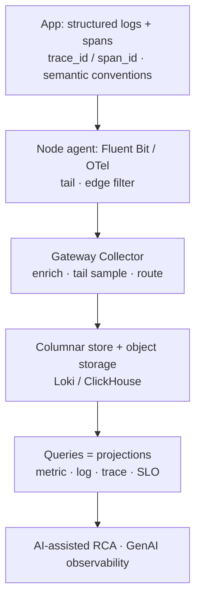

## References

- [OpenTelemetry 2026 Deep Dive — OTLP, Semantic Conventions, the Collector Pipeline, and Auto-Instrumentation](https://www.youngju.dev/blog/culture/2026-05-14-opentelemetry-2026-deep-dive-semantic-conventions-collector-pipeline-otlp-instrumentation.en)
- [OpenTelemetry Logs: Unified Telemetry Pipeline Architecture (2026)](https://iotdigitaltwinplm.com/opentelemetry-logs-unified-telemetry-pipeline-2026/)
- [There Is Only One Key Difference Between Observability 1.0 and 2.0 (charity.wtf)](https://charity.wtf/p/there-is-only-one-key-difference-between-observability-1-0-and-2-0)
- [Observability 2.0 vs. Observability 1.0 (Honeycomb)](https://www.honeycomb.io/blog/one-key-difference-observability1dot0-2dot0)
- [Observability 2.0 (GreptimeDB docs)](https://docs.greptime.com/user-guide/concepts/observability-2/)
- [Wide events or pillars of observability: A decision framework (Parseable)](https://www.parseable.com/blog/decision-framework-wide-events-or-traces)
- [Elasticsearch vs. OpenSearch vs. Loki vs. Quickwit vs. ClickHouse: Long-Term Log Archiving](https://blog.none.at/blog/2026/2026-05-14-es-os-loki-quickwit-clickhouse/)
- [Cost-efficient observability with ClickHouse (ClickStack) — 2026 playbook](https://clickhouse.com/resources/engineering/observability-cost-optimization-playbook)
- [OpenTelemetry Collector vs Fluent Bit (Parseable)](https://www.parseable.com/blog/otel-collector-vs-fluentbit)
- [Tail Sampling with OpenTelemetry](https://opentelemetry.io/blog/2022/tail-sampling/)
- [Observability trends for 2026: GenAI and OpenTelemetry (Elastic)](https://www.elastic.co/blog/2026-observability-trends-generative-ai-opentelemetry)

---

## Why I looked this up

Wanted a research note surveying where logging systems are heading — the current trends in how logs are instrumented, shipped, stored, and queried.

---

## What stood out

—

---

## What I learned

### Abstract

For a decade, logging meant "print a line of text, ship it through Fluentd, index it in something expensive, and grep during an incident." In 2026 that model is being dismantled from three directions at once. **Instrumentation** is converging on OpenTelemetry, where logs are now a first-class signal that ships over the same wire protocol as traces and metrics and carries `trace_id`/`span_id` for one-click correlation. **Data modeling** is shifting from free-text lines toward *structured* logs, and — at the leading edge — toward *wide events*: one context-rich, high-cardinality record per unit of work that becomes the single source of truth from which metrics, logs, and traces are just different queries ("observability 2.0"). **Storage** is moving off inverted-index-on-SSD stacks toward columnar engines and object storage, because the economics of high-cardinality data only work when compute and storage are decoupled. This note surveys those trends, the pipeline architecture that ties them together, and the cost pressures driving all of it.

### 1. Trend one — logs become a first-class OpenTelemetry signal

The single biggest structural change is that the **standardization war is over**: OpenTelemetry (OTel) won, and **OTLP** (the protobuf-over-gRPC/HTTP wire protocol) is effectively the only observability wire format. Tempo, Jaeger, Honeycomb, Datadog, New Relic, Dynatrace, Grafana Cloud, and SigNoz all accept OTLP; vendor-specific protocols survive only for legacy compatibility.

For logging specifically, the milestone is that the **OTel log signal went GA in late 2024**. The old world — "traces in OTel, logs in a separate Fluentd/Logstash pipeline" — is ending. One instrumentation model, one wire protocol, and one programmable routing tier (the Collector) now handle logs alongside traces and metrics.

| Item | Pre-2019 | 2026 |
|------|----------|------|
| Tracing standard | OpenTracing + OpenCensus in parallel | OpenTelemetry, single |
| Wire protocol | One per vendor | OTLP/gRPC (4317) + OTLP/HTTP (4318) |
| Logs | Separate pipeline (Fluentd, etc.) | One OTel signal |
| Metrics | Separate Prometheus camp | OTLP + Prometheus compat |
| Signals | Metrics, logs, traces | + Profiles (fourth signal) |

In OTLP the shape is a three-level tree that repeats across signals — for logs it is `ResourceLogs → ScopeLogs → LogRecord` (traces use `ResourceSpans → ScopeSpans → Span`). Bundling records from the same service and library together is also what makes the payload compress well.

### 2. Trend two — correlation via trace context is the whole point

The reason logs are called the "third pillar" is precise: logs became a *peer* of traces and metrics only once they gained a reliable, standardized way to point at the other two. That mechanism is `trace_id` and `span_id` carried inside the `LogRecord`. The killer feature of the OTel log signal is that these IDs are **attached automatically** when the application logs inside an active span, so trace-to-log and log-to-trace jumps are one click instead of hand-wired.

There is a subtlety that shapes real migrations: correlation only works if the IDs are actually *in* the record. Two things must be true. First, the application must have an active span in context when it logs. Second, you must use the **OTel logging bridge** (or an SDK-native appender) rather than writing plain text to a file that a separate agent scrapes with no knowledge of trace context. A `filelog` receiver tailing a plain-text file recovers the log *body* but cannot reconstruct a `trace_id` the application never wrote. This is why file-scraping is only a first step; mature deployments migrate from file scraping toward the logging bridge so the IDs are present at emit time.

### 3. Trend three — structured logs, then wide events (observability 2.0)

The data-modeling trend runs on a spectrum from free text to wide events:

| Stage | Shape | Query pattern | Context per record |
|-------|-------|---------------|--------------------|
| Free-text log | `"user 42 failed login"` | grep / full-text | whatever the developer printed |
| Structured log | `{user_id:42, event:"login", ok:false}` | field filters | a handful of keys |
| Wide event | 40–100 dimensions per unit of work | `SELECT … GROUP BY` any dimension | user_id, build_id, feature flags, region, latency, … |

**Structured (JSON) logging** is now the baseline recommendation — it is what makes high-cardinality, contextual events queryable at all, and it is the prerequisite for injecting `trace_id` cleanly.

The leading edge pushes further, to **wide events** and what Charity Majors calls **observability 2.0**. The core claim: instead of maintaining three separate systems (metrics, logs, traces), you keep **one source of truth — arbitrarily wide, structured log events** — from which the other signals are *derived*. A wide event is a context-rich record emitted once per unit of work (a request, a job, a queue hop) carrying all its metadata: `user_id`, `build_id`, feature flags, region, timing, status, and so on. Common composition patterns are **canonical log lines** (one summary event per request/hop) and spans (events organized around application logic).

The payoff is **retroactive, exploratory analysis**: when a new failure mode appears, you slice and dice by arbitrary high-cardinality dimensions (`build_id`, feature flag, `user_id`) *without* having predicted the question in advance and pre-built a dashboard for it. Metrics, logs, and traces stop being distinct data types and become different **projections** — different `SELECT`s — over the same events.

The honest tradeoff, repeated by practitioners (e.g. SimpliSafe's "north star, not silver bullet" framing), is **cost versus power**. Wide events carry 40–100 dimensions per request — far more data than any single pillar — so the objection is real. What makes them affordable is the storage layer (next section). Observability 2.0 is best treated as a direction, adopted pragmatically alongside cheap metrics, not a flip-the-switch replacement.

### 4. Trend four — storage moves to columnar engines and object storage

High-cardinality data is only affordable when the storage layer is built for its shape and when **compute is decoupled from storage** so the bulk of data can live in cheap object storage (S3/GCS). Three architectures dominate the current conversation:

| System | Index model | Compression / storage | Best at | Weak at |
|--------|-------------|-----------------------|---------|---------|
| **Elasticsearch / OpenSearch** | Inverted index (Lucene) | Index inflates storage ~3–5× raw; JVM heap ≈ 1/20–1/30 of data | Full-text search, ILM/ISM hot→frozen tiering | Analytical aggregations; cost at PB scale |
| **Loki** | Label-only index | Compressed chunks in object storage (~1.2–1.5× raw) | Cheapest ingest + long-term storage | Full-text search without label filters ≈ distributed grep |
| **ClickHouse** | Columnar (no free-text inverted index) | ZSTD + per-column codecs, 5–10× on structured logs; SQL TTL tiering to S3 | Analytical/high-cardinality queries, unified logs+metrics+traces | Free-text substring search falls back to columnar scan |

The unifying insight: **columnar storage compresses log data extremely well** because values of one column are stored together, so the compressor sees long runs of repeated `level`, `service`, `host` strings and monotonic timestamps. Even high-cardinality columns compress decently because per-column codecs adapt to each field's distribution — which is exactly why wide events (economically scary on SaaS) become affordable on columnar/object storage.

The economics are stark. Published sizing (100 GB/day, 7-year archive) puts long-term object-storage cost roughly at Loki ≈ €3,600, ClickHouse ≈ €7,400, Elasticsearch ≈ €11,400, OpenSearch ≈ €20,400 — Loki cheapest (no full-text index), ClickHouse second (columnar compression), inverted-index stacks most expensive. Real ELK→Loki and ELK→ClickHouse migrations report **80–90% cost reductions** at PB scale. Loki's TSDB index and label-only design, and ClickHouse's ZSTD + tiered `TTL … TO DISK/VOLUME` moving old data to S3, are the concrete levers.

There is no free lunch: Loki is cheapest to store but full-text search without tight label filters is effectively a distributed grep; ClickHouse needs stable fields declared as columns (mitigated by zero-downtime `ALTER TABLE ADD COLUMN` and the dynamic `JSON` column type) and has no Lucene-style inverted index; inverted-index stacks give the best free-text search but the highest storage bill.

### 5. Trend five — the programmable pipeline (Collector, Fluent Bit, Vector)

Between the app and the store sits a **programmable routing tier**, and the current best practice is a **two-tier topology**: a lightweight agent on every node, and a heavier gateway that aggregates cluster-wide.

The three tools in play, and why teams mix them:

- **OpenTelemetry Collector** — the vendor-neutral, multi-signal hub (receivers → processors → exporters). Processors like `memory_limiter` (safety net, must go first), `k8sattributes` (auto-attach pod metadata, belongs on the agent), `batch` (essentially required), `filter`/`transform` (OTTL), and `tail_sampling` (gateway only). Runs ~30–300 MB RAM.
- **Fluent Bit** — a C-based log forwarder, ~5–10 MB idle (~50 MB less per node than the Collector). A decade of maturity in file tailing, rotation handling, multiline parsing, and cheap regex filters at the edge. Ideal as the node-level DaemonSet.
- **Vector** — Datadog's Rust pipeline; excels at heavy transformation, VRL-based parsing, dedup, and per-destination routing in the middle tier (comfortably >100k events/sec).

The two production patterns that recur: **Fluent Bit reads files and pushes OTLP to a Collector**, or **the Collector's `filelogreceiver` reads files directly**. OTel's log receiver is strong, but Fluent Bit did not die — it is still more mature at tailing container log files.

### 6. Trend six — cost control via filtering and tail sampling

Because volume (and therefore bill) is the dominant constraint, **dropping noise as early as possible** is now a first-class design goal:

- **Edge filtering (cheapest).** At Fluent Bit on the node, drop noisy namespaces, health-check spam, and known-useless patterns with `grep`/Lua *before any data crosses the network*. One documented edge pipeline mirrors its sampling logic in a Lua filter and drops ~86% of log volume at the source.
- **Attribute filtering (richer).** At the Collector, drop by severity or enriched attributes (e.g. `k8s.deployment.name`) using OTTL — more expressive than regex, but costs CPU.
- **Tail sampling (traces, at the gateway).** Head sampling (random 1–10% at the SDK) throws away most error and slow-request traces. **Tail sampling** buffers spans until the trace completes, then keeps 100% of errors and 100% of slow traces while discarding routine fast successes — a large bandwidth cut with no loss of what matters. The gateway `tail_sampling` processor uses `decision_wait` (e.g. 10s) plus policies (status_code=ERROR, latency>threshold, probabilistic fallback). Caveat: sampled data skews aggregate counts unless you attach the sample rate so the backend can re-weight.

### 7. Trend seven — AI, both as subject and as tool

Two GenAI currents run through 2026 observability. First, **AI as a subject to be logged.** Non-deterministic LLM agents produce exactly the kind of data wide events were built for: high cardinality (millions of unique sessions), high dimensionality (dozens of fields per execution), and context-rich payloads. Stuffing prompts into text logs loses structure; pre-aggregating token counts loses the context you need to debug. OTel's **GenAI semantic conventions** (near stable) standardize this: `gen_ai.system` (openai/anthropic/…), `gen_ai.request.model`, `gen_ai.usage.input_tokens`/`output_tokens`, `gen_ai.response.finish_reasons`, `gen_ai.operation.name`. LangChain, LlamaIndex, OpenLLMetry, and Arize Phoenix already track them, so LLM cost/latency/failure lands in a standardized shape.

Second, **AI as a tool for analysis.** Vendors are folding AI-assisted root-cause analysis on top of ingested telemetry, and OTel/semantic-convention compliance is becoming a hard vendor-selection requirement precisely because AI features need clean, standardized, high-fidelity input. Adjacent to this, the "three pillars" quietly became four: **continuous profiling** entered OTLP as the fourth signal (pprof-compatible schema), and **eBPF auto-instrumentation** (Beyla, Coroot, Pixie) now produces traces from unmodified binaries — no SDK required.

### 8. Synthesis — one shape, many projections

**Design thesis.** Emit **structured** logs that carry trace context at the source (logging bridge, not file scraping). Follow **semantic conventions** so the data is portable and AI-analyzable. Insert a **Collector layer** — never SDK-straight-to-backend — and push filtering/sampling as close to the edge as possible. Choose storage by *query shape*: label-indexed object storage (Loki) for cheap operational logs, columnar (ClickHouse) for high-cardinality analytics, inverted index (ES/OpenSearch) only where full-text search dominates. Treat metrics/logs/traces as **projections of the same wide events** where you can afford it, and let cost — not dogma — set how far toward observability 2.0 you go.

### 9. Conclusion

The through-line of 2026's logging trends is **convergence and re-projection**. Instrumentation converges on OpenTelemetry; the wire converges on OTLP; the three (now four) signals converge toward a single wide-event source of truth from which everything else is a query. The enabling substrate is columnar compression plus object storage that makes high-cardinality data cheap, and a programmable pipeline that filters and samples aggressively to keep the bill in check. Logging stopped being "text you grep" and became "structured, correlated events you query" — the third pillar finally standing level with traces and metrics. Natural follow-ups: operating the Collector pipeline in depth, wide-event/columnar-storage internals, the Loki-vs-ClickHouse economics math, and GenAI/LLM observability.

---

## Review quiz

*Click a card to reveal the answer.*

:::quiz
**Q1.** Why is the OTel *logging bridge* preferable to just tailing a plain-text log file, when correlation is the goal?
---
Correlation depends on `trace_id`/`span_id` being *inside* the log record. The logging bridge (or an SDK-native appender) reads the active span's context and writes those IDs at emit time. A `filelog` receiver scraping a plain-text file recovers the message body but cannot reconstruct a `trace_id` the application never wrote — so file scraping is only a first migration step.
:::

:::quiz
**Q2.** In observability 2.0, how are metrics, logs, and traces related to a wide event?
---
They are not separate data types but different **projections** (queries) over the same wide structured events. Metrics ≈ `COUNT(*) … GROUP BY status, minute` (aggregated), logs ≈ `WHERE message @@ 'error'` (text), traces ≈ `WHERE trace_id = '…'` (relational). One source of truth, derived signals.
:::

:::quiz
**Q3.** Why does columnar storage (ClickHouse) compress log data so well, and what is the trade-off versus Loki and Elasticsearch?
---
Columnar stores keep all values of one column together, so the compressor sees long runs of repeated `level`/`service`/`host` and monotonic timestamps; per-column codecs (ZSTD) adapt to each field, giving ~5–10× on structured logs. Trade-off: ClickHouse has no Lucene-style inverted index (free-text falls back to columnar scan); Loki is cheapest to store but full-text without label filters is a distributed grep; Elasticsearch gives the best full-text search but inflates storage ~3–5× and costs the most at scale.
:::

:::quiz
**Q4.** What does tail sampling capture that head sampling loses, and where in the pipeline does it run?
---
Head sampling decides randomly at the SDK (e.g. 1–10%), so it discards most error and slow-request traces. Tail sampling runs in the **gateway Collector**, buffering spans until the trace completes (`decision_wait`), then keeping 100% of errors and slow traces while dropping routine fast successes — big bandwidth savings without losing the interesting traces. (Watch out: sampled data skews aggregate counts unless the sample rate is attached for re-weighting.)
:::

:::quiz
**Q5.** Why are non-deterministic LLM/AI agents a natural fit for wide events rather than classic logs or pre-aggregated metrics?
---
LLM agents emit high-cardinality (millions of unique sessions), high-dimensional (dozens of fields per call), context-rich data. Stuffing prompts into text logs loses structure; pre-aggregating token metrics loses the context needed to debug non-determinism. Wide events (with OTel `gen_ai.*` semantic conventions like `gen_ai.usage.input_tokens`) preserve the raw, structured, retroactively queryable detail those systems require.
:::

---

## Memo

—
