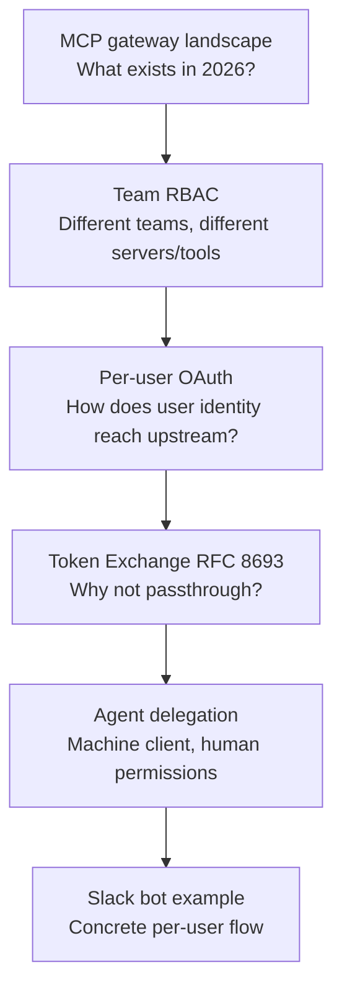

> Source: [Microsoft MCP Gateway](https://github.com/microsoft/mcp-gateway) · [MCP Authorization spec](https://modelcontextprotocol.io/specification/2025-03-26/basic/authorization) · [RFC 8693 Token Exchange](https://datatracker.ietf.org/doc/html/rfc8693) · [Cursor MCP docs](https://cursor.com/docs/mcp) · conversation study session (2026-07-09)

---

## Why I looked this up

This note captures a single deep-dive session that started broad and narrowed through six questions.

1. **What is the current state of MCP gateway?** — Wanted a landscape snapshot: what exists in the ecosystem, what's active, and how Cursor fits in.
2. **How do teams share one gateway with different permissions?** — If a company runs one MCP gateway for many teams, how does each team get different access to different MCP servers?
3. **How is per-user OAuth even possible?** — Understood the concept of team RBAC, but not the mechanism for running upstream calls as the real user instead of a shared bot account.
4. **Explain token exchange in more depth** — Per-user OAuth led to RFC 8693; needed the wire format, claims, and why passthrough is forbidden.
5. **What if the caller is an agent/service, not a human?** — Wanted agents (Slack bots, background workers) to act with the **invoking user's** permissions, not their own service account.
6. **Concrete example: Slack bot** — Needed a end-to-end picture: Alice and Bob hit the same bot, but Jira/Slack calls run under each user's own credentials.

The thread moved from **ecosystem survey → team RBAC → user OAuth → token exchange → agent delegation → Slack bot implementation**.

---

## What stood out

Learned a lot today — read a lot too. The amount of material was substantial, which is why I wanted this written up without gaps.

---

## What I learned

### 1. MCP gateway landscape (2026)

An **MCP gateway** sits between MCP clients (Cursor, Claude Desktop, Slack bots) and upstream MCP servers. It centralizes auth, RBAC, audit, session routing, and credential management.

```
MCP Client → Gateway (single URL) → MCP Server A / B / C
```

| Project | Stars (approx.) | Last activity | Character |
|---------|-----------------|---------------|-----------|
| Bifrost | ~6.4k | 2026-07 | LLM + MCP gateway, Go binary |
| Docker MCP Gateway | ~1.5k | 2026-07 | CLI plugin, local/container |
| IBM ContextForge | ~4k | 2026-07 | MCP/A2A/REST unified gateway |
| Obot | ~879 | 2026-07 | Hosting + registry + gateway |
| **Microsoft MCP Gateway** | ~733 | 2026-06 | K8s/Azure native, Entra ID |
| MetaMCP | ~2.5k | 2026-06 | Aggregator in Docker |

Commercial: MintMCP, TrueFoundry, Lunar MCPX, Kong, AWS Bedrock AgentCore Gateway, etc. The category has 40+ tracked projects; consolidation is expected but no single standard yet.

**Microsoft MCP Gateway** (representative open-source option):

- Dual plane: **Data Plane** (MCP traffic routing) + **Control Plane** (adapter/tool CRUD)
- Key endpoints: `POST /adapters/{name}/mcp`, `POST /mcp` (tool gateway router)
- Session-aware stateful routing on Kubernetes
- Entra ID app roles (`mcp.admin`, `mcp.engineer`, …) + `requiredRoles` on adapters
- Agents & Sessions (Preview): opt-in, requires Azure Foundry
- Recent work (June 2026): security hardening for built-in tools and nested agent authorization
- No GitHub releases — deploy from `main`

**Cursor** has no first-party MCP gateway. Enterprise controls: MCP Allowlist, per-server tool/network policy, Team MCP distribution, Hooks (`beforeMCPExecution` / `afterMCPExecution`). Partners (MintMCP, Runlayer) provide gateway/broker layers via Hooks. Cloud Agents do not yet support MCP execution hooks.

**This workspace** (`research-notes`) has no MCP gateway implementation. Current Cloud Agent MCP: `cursor-cloud` (ready), `Notion` (needsAuth).

---

### 2. Team RBAC — how different teams get different access

Core principle: permissions at the **tool level**, not the server level. "Access to Jira MCP" is too broad — `search_issues` (read) and `delete_project` (admin) must be separated.

Three-layer model:

| Layer | Role | Example |
|-------|------|---------|
| Authentication (Who) | Verify identity | SSO, API key, M2M JWT |
| Role mapping (What role) | IdP group → gateway role | `eng-team` → `engineering` |
| Tool policy (Which tools) | Role → tool groups | `engineering` → reads + writes |

**Enforcement at two points:**

1. **Discovery** — `tools/list` returns only tools the caller may see
2. **Execution** — `tools/call` denied if role lacks permission (403 before upstream)

**Default deny** — unlisted tools blocked at both stages.

#### Gateway-specific RBAC models

| Gateway | RBAC mechanism |
|---------|----------------|
| **Microsoft MCP Gateway** | Entra ID app roles → adapter `requiredRoles`. Read: creator, `mcp.admin`, or matching role. Write: creator or `mcp.admin` only. Strong for adapter-level access; less granular inside one adapter. |
| **Lunar MCPX** | YAML ACL: `toolGroups` (reads/writes/admin) + `consumers` (developers/marketing). Default `base: block`. API key or consumer tag per agent. |
| **Bifrost** | Virtual key per role with explicit tool allow-list. Deny-by-default. |
| **MintMCP** | SCIM-driven RBAC + Virtual MCP Bundles (per-use-case endpoint). Tool-level allowlist. IdP group ↔ bundle membership. |

#### Practical enterprise rollout

1. IdP groups = teams (`grp-mcp-engineering`, `grp-mcp-marketing`)
2. Tool groups by action: `reads`, `writes`, `admin`
3. Role → tool group matrix
4. Optional: separate gateway endpoints per team (`/engineering`, `/support`, `/admin`)
5. Credential strategy: per-user OAuth + service accounts where appropriate

**ABAC (advanced):** argument-level constraints — e.g. `zendesk.reply_to_ticket` with `public: false` only.

---

### 3. Per-user OAuth — how it works

Per-user OAuth means upstream APIs (Jira, Slack, Snowflake) are called with **each user's own credentials**, not a shared service account.

#### Without gateway (broken)

```
All engineers → Gateway → Jira (bot-account)
CURRENT_USER() = BOT — no per-user RLS, no individual audit, no per-user revoke
```

#### With per-user OAuth

```
Alice → Gateway → Jira (Alice token) — Alice's projects only
Bob   → Gateway → Jira (Bob token)   — Bob's projects only
```

#### Mechanism: gateway as OAuth broker + token vault

1. User completes OAuth consent once (browser flow)
2. Gateway stores `{user → {jira_token, slack_token, refresh, exp}}` in vault
3. On each tool call, gateway injects that user's token — Cursor never sees upstream tokens
4. Gateway handles refresh

Cursor remote MCP OAuth callbacks: `https://www.cursor.com/agents/mcp/oauth/callback`, `cursor://anysphere.cursor-mcp/oauth/callback`

#### stdio MCP servers

Many MCP servers are local stdio + env var (`GITHUB_PERSONAL_ACCESS_TOKEN=...`). Gateway converts stdio → remote and brokers OAuth (MintMCP, mcp-auth-gateway pattern): spawn per-user process, inject credential via Unix socket or env at call time.

#### Token storage comparison

| Approach | Where credentials live | Best for |
|----------|------------------------|----------|
| Service account | Gateway vault (one shared) | Org-wide read-only data |
| Per-user OAuth | Gateway vault (user × service) | Jira, Slack, Snowflake with RLS |
| Per-user PAT in Vault | HashiCorp Vault path per user | Legacy APIs without OAuth |
| Client-side | Cursor keychain | Dev/local only |

Gateway RBAC + upstream user credentials stack — both must pass.

---

### 4. Token Exchange (RFC 8693)

Token exchange swaps one token for another with a **different audience and narrower scope**, preserving user identity (`sub`).

#### Why not token passthrough?

MCP spec §7.3: each MCP server is a separate Resource Server with its own audience. Passthrough violates this.

| Problem | Effect |
|---------|--------|
| Confused deputy | Stolen gateway token replayed against other services |
| Audience collapse | Token minted for gateway accepted upstream |
| Audit destruction | Proxy decisions invisible in upstream logs |

**Rule:** a token crosses exactly one trust boundary — the one it was minted for. Every hop needs a new token.

#### RFC 8693 request

```http
POST /token HTTP/1.1
Host: idp.company.com
Content-Type: application/x-www-form-urlencoded
Authorization: Basic <gateway_client_id:secret>

grant_type=urn:ietf:params:oauth:grant-type:token-exchange
&subject_token=<Alice gateway JWT>
&subject_token_type=urn:ietf:params:oauth:token-type:jwt
&audience=https://myaccount.snowflakecomputing.com
&requested_token_type=urn:ietf:params:oauth:token-type:access_token
&scope=snowflake:query
```

#### Response token payload

```json
{
  "iss": "https://idp.company.com",
  "aud": "https://myaccount.snowflakecomputing.com",
  "sub": "alice@company.com",
  "scope": "snowflake:query",
  "exp": 1735689600
}
```

| Claim | Input token | Output token |
|-------|-------------|--------------|
| `aud` | `mcp-gateway` | `snowflake` |
| `sub` | `alice@company.com` | `alice@company.com` (preserved) |
| `scope` | broad | narrow |

#### Three patterns compared

| Pattern | Downstream identity | MCP spec | Production fit |
|---------|---------------------|----------|----------------|
| Service account | BOT | N/A | No user RLS |
| Token passthrough | User (same token) | Violates | Forbidden |
| Token exchange | User (new token) | Compliant | Recommended |

#### Gateway 3-stage pipeline

```
Stage 1 — Authenticate: JWT signature, aud=gateway, reject alg=none
Stage 2 — Authorize: tool required scope in JWT → 403 if missing
Stage 3 — Exchange: RFC 8693 → downstream-audience token → upstream MCP server
```

Stage 3 only for **user-impersonation** platforms (Snowflake, etc.). Org-wide app-key downstreams bypass exchange.

#### Per-server exchange on each tool call

Same Alice gateway JWT, different exchanges:

- `jira.search_issues` → Jira-audience JWT (`scope=jira:read`)
- `snowflake.run_query` → Snowflake-audience JWT (`scope=query`)
- `github.create_pr` → GitHub-audience JWT (`scope=repo:write`)

Compromised Jira server cannot replay token against Snowflake (`aud` mismatch).

#### Impersonation vs delegation (RFC 8693 §1.1)

| Mode | JWT shape | Audit |
|------|-----------|-------|
| **Impersonation** | Token *is* the user, no actor trace | Downstream sees user only |
| **Delegation** | `sub`=user + `act`=actor (nested for multi-hop) | Full chain visible |

For MCP/agents, **delegation** is preferred — logs show "agent X acted for user Y via gateway Z."

#### Actor + Subject (on-behalf-of)

```
subject_token = Alice JWT (who permissions apply to)
actor_token   = Gateway/Agent JWT (who performs the exchange)
→ output: sub=Alice, act=Gateway/Agent
```

Requires IdP actor/subject app modeling (Okta, Entra) — one-time tenant setup.

#### Tool auth modes (fail-closed)

| Mode | User context | Example |
|------|--------------|---------|
| `user-impersonation` | Required — fail if missing | `snowflake.run_query` |
| `service-account` | Not needed | internal metrics |
| `app-key` | Not needed | legacy public API |

**Never** silently fall back from user-delegation to service account on missing user context.

#### Production gotchas

- IdP must support RFC 8693 and trust gateway as exchange client
- Downstream platform trust config (Snowflake External OAuth, Tableau Connected Apps, etc.)
- Per-platform audience binding (RFC 8707)
- Exchange token caching — wrong cache key = cross-user token mixup (worst bug)

---

### 5. Agent/service acting with user permissions

When the MCP **client is an agent** (Slack bot, background worker), not a human at a keyboard:

```
Goal: same agent code, different user permissions per invocation
Alice triggers agent → upstream runs as Alice
Bob triggers agent   → upstream runs as Bob
```

#### JWT claims for agents

```json
{
  "sub": "alice@company.com",
  "aud": "https://jira-mcp.company.com",
  "scope": "jira:read",
  "act": {
    "sub": "slack-bot",
    "iss": "https://idp.company.com"
  }
}
```

| Claim | Meaning |
|-------|---------|
| `sub` | Permission subject — Alice |
| `act` | Executor — slack-bot agent |
| Audit | `user=alice, agent=slack-bot, tool=jira.create_issue` |

#### Three ways to pass user context to an agent

| Pattern | How user context arrives | Best for |
|---------|--------------------------|----------|
| **A. Interactive** | User JWT in request (Cursor, chat UI) | User present at keyboard |
| **B. Delegated token at invoke** | Short-lived token minted when workflow starts | Background/scheduled jobs |
| **C. OBO at gateway** | Agent M2M JWT + `X-On-Behalf-Of: Alice JWT` | Enterprise multi-agent |

#### OBO flow

```
1. Agent M2M JWT verified (agent identity)
2. Alice JWT verified (user identity)
3. IdP may_act policy: can this agent act for this user?
4. Token exchange: subject=Alice, actor=Agent → downstream token
5. Audit: user + agent + tool
```

#### Multi-hop delegation chain

```
Alice → Oncall Agent → Investigation Agent → Gateway → Jira
         act (nested)     act (outer)
```

Each hop: token exchange + scope narrowing. Uber (2026) and AWS AgentCore Identity (2026) document this pattern.

#### IdP `may_act` policy example

```
agent:oncall-bot → may_act_for: group "oncall-engineers", scopes: [jira:read], max: 4h
agent:hr-assistant → may_act_for: group "hr-team", scopes: [workday:read]
agent:deploy-bot → DENY (service-account only)
```

#### MCP Enterprise-Managed Authorization (EMA, 2026)

MCP extension: admin sets agent-user-server policies in IdP centrally. User SSO once; agents get ID-JAG assertion without per-server consent screens. Okta (XAA), Anthropic, VS Code, Atlassian among launch partners.

#### Anti-patterns

| Don't | Why |
|-------|-----|
| Store user tokens permanently in agent | Leak = full user access |
| Fallback to service account when user context missing | Privilege escalation |
| Passthrough user JWT to downstream | Confused deputy |
| Agent calls without agent identity | No audit trail |
| `may_act: *` for all agents | Compromise = all users |

---

### 6. Slack bot example — per-user permissions end-to-end

**Goal:** `@bot create Jira ticket` runs under the **requester's** Jira/Slack permissions, not the bot's.

#### Why bot token alone fails

Slack bot token (`xoxb-`) = one identity for all users. Bot permissions become everyone's permissions.

#### Architecture

```
Alice/Bob → Slack → Bot Service (agent M2M) → MCP Gateway (vault) → Slack/Jira MCP → Upstream APIs
```

#### One-time user linking (`/bot-link`)

1. User runs `/bot-link` in Slack
2. Browser OAuth: Slack user scopes + Jira (company SSO)
3. Gateway vault: `alice@company.com → {slack_user_token, jira_token, refresh}`
4. Bot confirms: "Connected — requests will use your permissions"

Slack app needs **user scopes** (not just bot scopes):

```yaml
oauth_config:
  scopes:
    bot: [chat:write, app_mentions:read]
    user: [channels:read, channels:write, users:read]  # per-user token
```

#### Per-request flow

```
1. Alice @bot "post announcement to ENG"
2. Slack event: user=U_ALICE
3. Bot Service → Gateway:
     Authorization: Bearer {bot M2M JWT}
     X-Slack-User-Id: U_ALICE
4. Gateway: U_ALICE → alice@company.com → vault tokens
5. tools/call slack.post_message → Alice Slack user token
6. Slack API: succeeds only if Alice can write to ENG
7. Bot replies to Alice in thread (bot token OK for UI)
```

Bob same request → Bob token → Slack 403 if no ENG write access.

#### Token usage by tool type

| Tool | Token | Rationale |
|------|-------|-----------|
| `slack.post_message` | Alice **user token** | Alice's channel permissions |
| `slack.read_messages` | Alice user token | Alice's visible channels |
| `jira.create_issue` | Alice **Jira token** | Alice's project access |
| Bot thread reply (UI) | Bot token | Bot↔user conversation only |

**Principle:** upstream API calls = user token; bot↔user UI = bot token.

#### Slack user_id → corporate identity

| Method | Notes |
|--------|-------|
| Enterprise Grid + SSO | SCIM sync, profile email = IdP email |
| OAuth link flow | Store mapping at `/bot-link` time |
| `users.info` API | Lookup profile.email |

#### Security checklist

- Bot Service never holds user tokens — Gateway vault only
- Validate event.user matches token owner
- Refresh tokens in gateway; re-link on expiry
- Bot M2M compromise alone cannot call upstream without user context
- Audit log: `{slack_user, email, agent, tool, timestamp, result}`

#### Unlinked user

```
Alice: @bot create Jira ticket
Bot: Run /bot-link first to connect your Slack and Jira accounts.
```

---

### Curiosity map (session arc)



| Step | Question | Key answer |
|------|----------|------------|
| 1 | Gateway 현상태? | 40+ projects, no Cursor first-party gateway, Microsoft/Docker/Bifrost/Obot as references |
| 2 | 팀별 권한? | Tool-level RBAC, default deny, IdP groups → tool groups, optional per-team endpoints |
| 3 | Per-user OAuth? | Gateway OAuth broker + vault; user consent once, inject per call |
| 4 | Token exchange? | RFC 8693: re-scope aud/sub, forbid passthrough, actor+subject for agents |
| 5 | Agent + user permissions? | OBO: agent=act, user=sub, may_act policy, fail-closed |
| 6 | Slack bot? | event.user → gateway → vault → user token for upstream, bot token for UI |

---

### Reference links

| Resource | URL |
|----------|-----|
| Microsoft MCP Gateway | https://github.com/microsoft/mcp-gateway |
| Microsoft MCP Gateway docs | https://microsoft.github.io/mcp-gateway/ |
| Entra app roles setup | https://github.com/microsoft/mcp-gateway/blob/main/docs/entra-app-roles.md |
| MCP Authorization spec | https://modelcontextprotocol.io/specification/2025-03-26/basic/authorization |
| RFC 8693 | https://datatracker.ietf.org/doc/html/rfc8693 |
| Cursor MCP docs | https://cursor.com/docs/mcp |
| Cursor Enterprise MCP policy | https://cursor.com/docs/enterprise/model-and-integration-management |
| Lunar MCPX ACL | https://docs.lunar.dev/mcpx/access_control_list/ |
| Solo agentgateway OBO | https://docs.solo.io/agentgateway/latest/mcp/token-exchange/obo/delegation/ |
| Red Hat MCP Gateway auth | https://developers.redhat.com/articles/2025/12/12/advanced-authentication-authorization-mcp-gateway |
| MCP Auth explained (Darek) | http://blog.dwornikowski.com/posts/mcp-auth-explained/ |
| Token exchange in production (Ultrathink) | https://ultrathinksolutions.com/the-signal/mcp-gateway-authentication/ |

---

## Memo

Full session capture — landscape, team RBAC, per-user OAuth, RFC 8693 token exchange, agent OBO delegation, and Slack bot example. Written to leave nothing out from today's reading.
