## References

- [Introduction to OpenSearch](https://docs.opensearch.org/latest/getting-started/intro/)
- [OpenSearch concepts](https://docs.opensearch.org/latest/getting-started/concepts/)
- [OpenSearch Core (platform overview)](https://opensearch.org/platform/opensearch-core/)
- [Creating a cluster / node types](https://docs.opensearch.org/latest/tuning-your-cluster/)
- [Query DSL](https://docs.opensearch.org/latest/query-dsl/)
- [Aggregations](https://docs.opensearch.org/latest/aggregations/)
- [Mappings](https://docs.opensearch.org/latest/mappings/)

---

## Why I looked this up

Asked for a detailed paper-style introduction to OpenSearch’s basic features, then for architecture diagrams so the hierarchy and request/write paths are easier to picture.

---

## What stood out

—

---

## What I learned

### Abstract

OpenSearch is a **distributed search and analytics engine** built on Apache Lucene. Its public surface looks like “put JSON in, get ranked hits and charts out,” but the useful mental model is a **hierarchy of documents → indices → shards → nodes → cluster**, with an **inverted index** for lexical search, a **translog / refresh / flush / merge** write path for durability and visibility, and a **Query DSL + aggregations** API for retrieval and analytics. This note surveys those core primitives—what each owns, how requests flow, and which defaults matter in design reviews—without diving into cross-cluster replication or region migration (covered elsewhere).

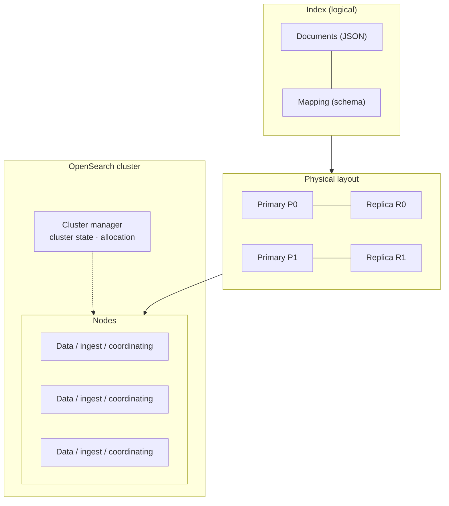

### 1. Introduction — what “search and analytics engine” means

OpenSearch targets workloads from website search boxes to security log analytics and observability. “Distributed” means the same logical index can span many machines; “search and analytics” means the same store answers both **relevance-ranked retrieval** and **statistical summaries** (aggregations), often in one request.

For an engineer, the useful framing questions are:

| Question | Why it matters |
|----------|----------------|
| What is the unit of storage and retrieval? | Document (JSON) inside an index |
| How does data scale beyond one disk? | Shards distribute documents across nodes |
| Who coordinates vs who stores? | Cluster manager vs data vs coordinating/ingest roles |
| When is a write durable vs searchable? | Translog ack vs refresh |
| How do you ask for matches vs summaries? | Query DSL vs aggregations |
| How is text turned into searchable terms? | Analyzers → inverted index; BM25 for ranking |

OpenSearch Core sits under optional plugins and Dashboards: lexical search (BM25), vector/k-NN and hybrid search, security, alerting, and ML extend the same document/index substrate.

### 2. Data model — documents, indices, mappings

**Document.** The atomic unit of information, stored as JSON. Analogies that help: one row in a relational table, or one searchable record returned by a query. Documents have an ID (client-supplied or auto-assigned) and one or more fields.

**Index.** A named collection of related documents—closer to a **table** than to a RDBMS “database.” You search against one or more indices. Indices carry settings (shard/replica counts, refresh interval, …) and a **mapping** (schema).

**Mapping.** The schema for how fields are stored and indexed. OpenSearch can infer types dynamically, but production systems usually define mappings explicitly so a phone number does not become a `text` field that is tokenized and scored like prose.

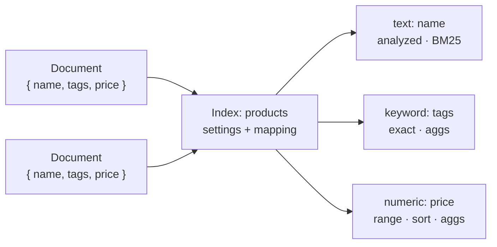

Common field-type families:

| Family | Typical use | Search behavior |
|--------|-------------|-----------------|
| `text` | Full-text body, titles | Analyzed → tokens in inverted index; relevance scoring |
| `keyword` | IDs, tags, exact filters, aggregations | Exact match; no analysis (or normalizer only) |
| Numeric / `date` / `boolean` | Metrics, timestamps, flags | Range, sort, aggregate via doc values |
| Object / nested | Structured sub-documents | Nested preserves object identity for queries |
| Geo / vector | Locations, embeddings | Specialized query types (geo, k-NN) |

**Multi-fields** are the standard pattern for “search *and* facet the same string”: map `product_name` as `text` with a `keyword` subfield (e.g. `product_name.raw`) so full-text search and aggregations do not fight each other. Aggregating directly on analyzed `text` (via `fielddata`) is expensive and discouraged.

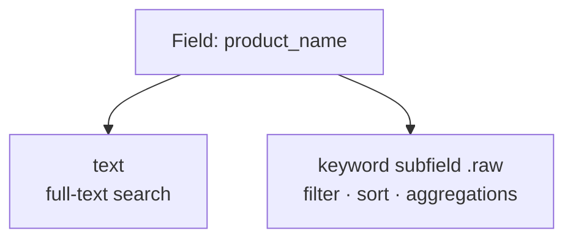

### 3. Cluster architecture — nodes and roles

An OpenSearch **cluster** is one or more **nodes** that share a `cluster.name` and form a single coherent state. In a single-node laptop cluster, one process does everything. In production, roles are split so cluster metadata work does not compete with heavy indexing or search.

| Role | Owns | Production note |
|------|------|-----------------|
| **Cluster manager** | Cluster state: indices, mappings, shard allocation, membership | Prefer **3 dedicated** managers across zones for quorum |
| **Data** | Stores shards; runs indexing, search, aggregations on local shards | Disk- and RAM-heavy; scale in zone-balanced multiples |
| **Ingest** | Runs ingest pipelines before documents hit an index | Dedicated when pipelines are CPU-heavy |
| **Coordinating** | Routes client requests, fans out to shards, reduces results | Every node can coordinate; dedicated empty `node.roles: []` for search-heavy fans-out |
| **Search / ML / others** | Specialized workloads (search replicas, ML tasks, …) | Isolate when those workloads would steal data-node capacity |

Default: each node is cluster-manager-eligible, data, ingest, and coordinating. Dedicated roles are set via `node.roles` in `opensearch.yml`. Traffic from clients and Dashboards should prefer ingest/coordinating/data nodes—not the cluster manager.

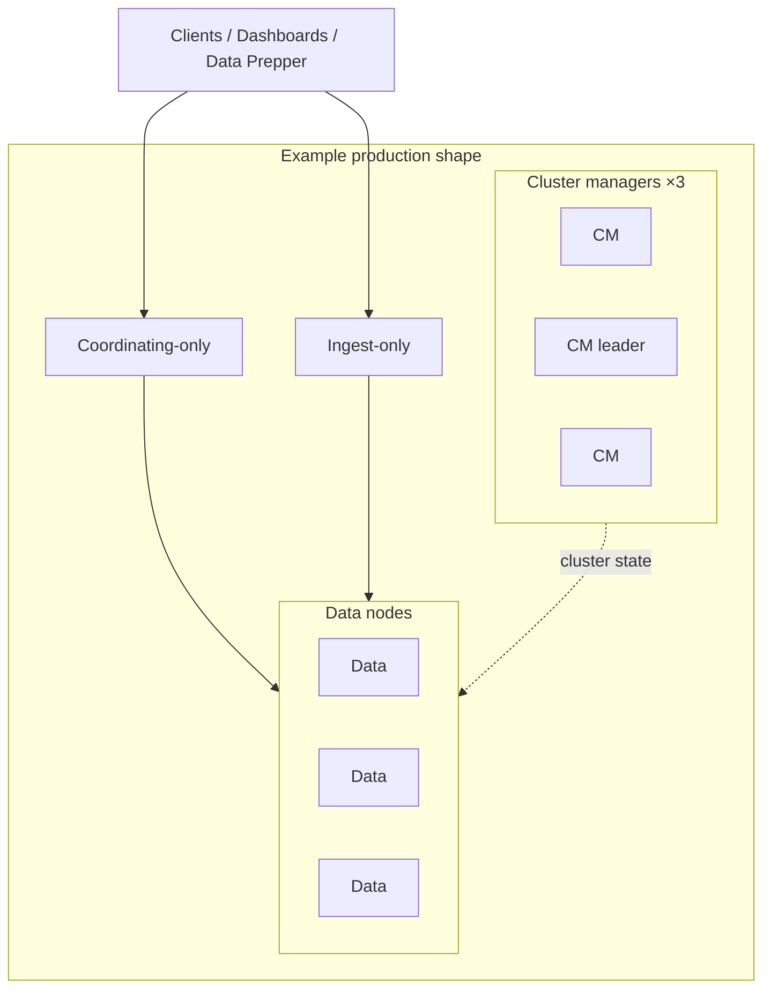

Search / index request path (data plane):

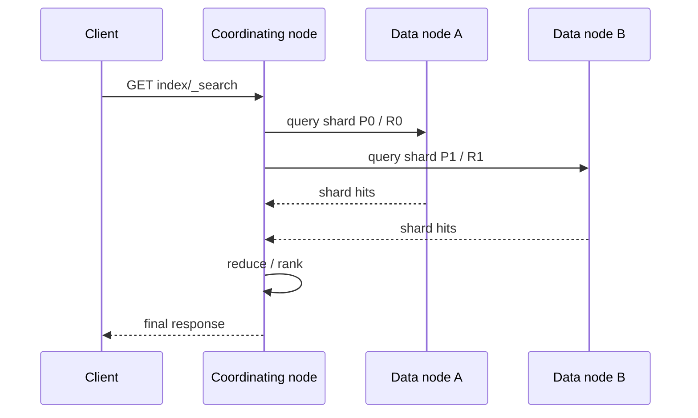

Cluster-manager work (create index, update mapping, allocate shards) is separate from that data path but must stay healthy: a lost quorum freezes cluster-state changes even if searches on already-allocated shards continue for a while.

### 4. Shards and replicas — the unit of distribution

OpenSearch **splits an index into shards**. Each shard is a complete Lucene index holding a subset of the documents. Shards exist so a large logical index can be spread across disks and CPUs.

- **Primary shard** — the authoritative copy that accepts writes for its document subset.
- **Replica shard** — a copy of a primary: failover if the primary’s node dies, and extra capacity for search reads.

Defaults matter in reviews: open-source OpenSearch commonly defaults to **1 primary + 1 replica** (2 shard copies total); managed offerings (e.g. Amazon OpenSearch Service) may use different historical defaults. **Primary shard count is fixed at index creation** for a given index (absent reindex/split/shrink workflows); replica count can be changed live.

Design rules of thumb from the docs:

- Target roughly **10–50 GB per shard** — too many tiny shards waste heap and file handles; too few huge shards hurt parallelism and recovery time.
- Replicas land on **different nodes** than their primary.
- More replicas help **read-heavy** workloads and availability; they cost disk and indexing fan-out write amplification.

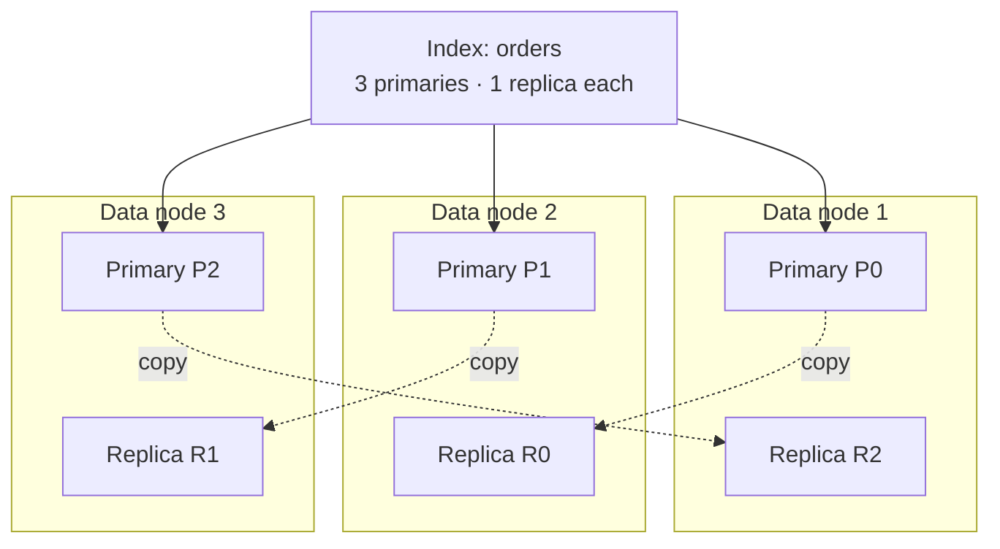

Each shard is itself a Lucene index of immutable segments:

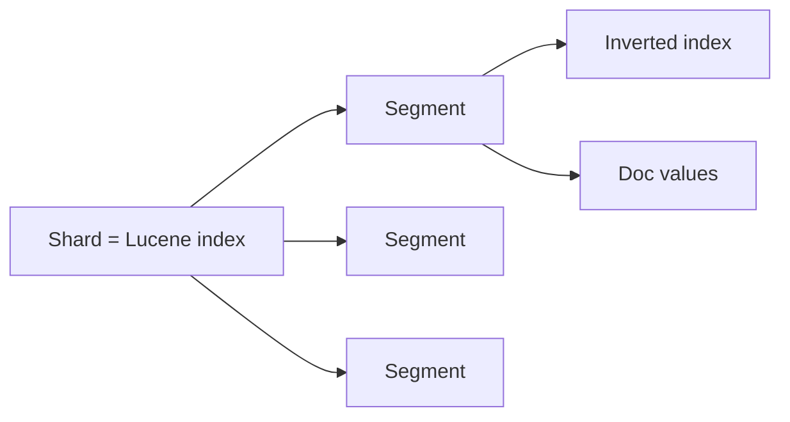

### 5. Inverted index, analysis, and relevance

Lexical search rests on an **inverted index**: a map from **terms** to the documents (and positions) that contain them. Example documents “Beauty is in the eye of the beholder” and “Beauty and the beast” share the term `beauty` after analysis lowercases tokens.

**Text analysis** runs at index time (and usually at query time for full-text queries):

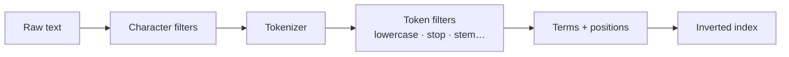

1. **Character filters** — normalize raw characters.
2. **Tokenizer** — split into tokens (often words) with positions.
3. **Token filters** — lowercase, stopwords, stemming, synonyms, …

The default **standard analyzer** lowercases and tokenizes; that is why searches are typically case-insensitive for `text` fields. Phrase queries use stored positions so terms must appear near each other.

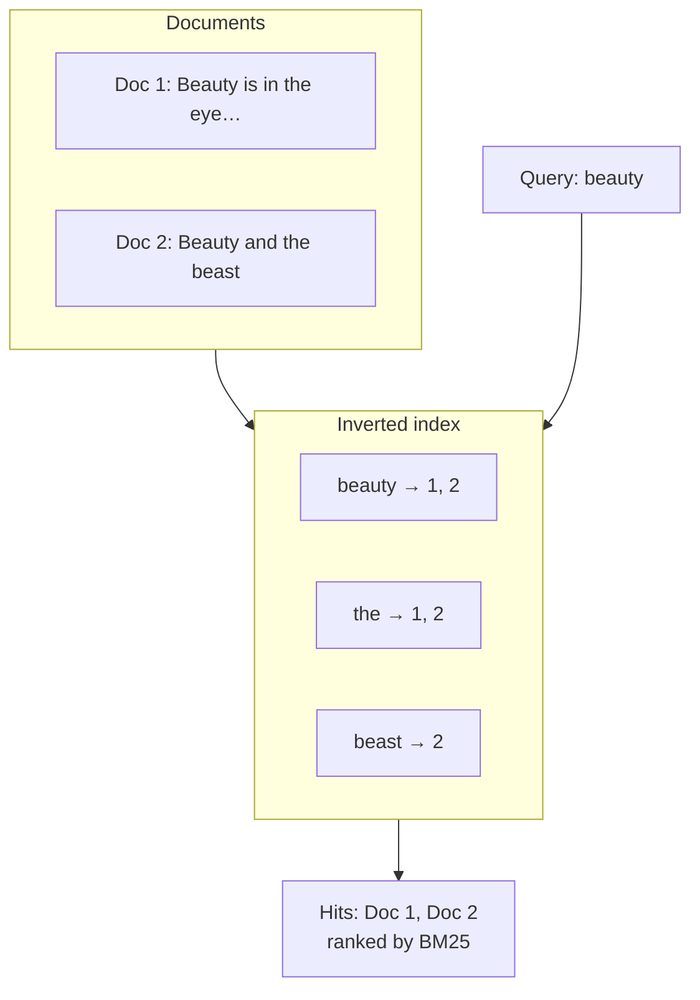

**Relevance.** Matching documents get a score. OpenSearch ranks with **Okapi BM25**, combining:

| Component | Intuition |
|-----------|-----------|
| Term frequency | More occurrences of a rare-enough term → higher score |
| Inverse document frequency | Terms that appear in fewer documents are more distinctive |
| Length normalization | Matches in short documents beat the same match diluted in a huge document |

**Query context** asks “how well does this match?” (scores). **Filter context** asks “does it match?” (yes/no, cacheable, no score). Production query design keeps filters (tenant ID, status, time range) in filter context and reserves scoring for the relevance clause.

### 6. Write path — durability vs search visibility

Indexing is not “write once to Lucene and done.” Official concepts docs describe a lifecycle:

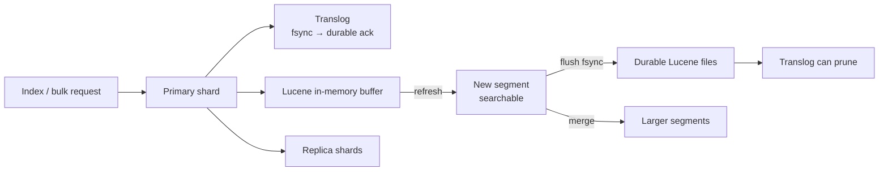

1. **Accept on primary** — write to the shard **translog**; fsync the translog before ack so the update is **durable**. Also hand the change to the Lucene writer’s in-memory buffer. Replicate to replicas as configured.
2. **Refresh** — periodically turn the in-memory buffer into new on-disk **segments** and open a new reader so documents become **searchable**. Often called a soft commit: on disk, but not yet the durability boundary for Lucene files.
3. **Flush** — fsync Lucene segments so they are durably persisted; then the corresponding translog entries can be purged.
4. **Merge** — segments are **immutable**; smaller segments merge into larger ones over time to reclaim deletes/updates and keep search efficient.

Operational consequences:

| Concern | Mechanism |
|---------|-----------|
| Client got `201` but search misses the doc | Refresh has not run yet (`refresh_interval`, or `?refresh=true` / `wait_for`) |
| Node crash after ack | Translog replay recovers durable ops not yet in flushed segments |
| Disk and search latency under heavy writes | Merge policy and segment count; too many tiny segments hurt |
| Updates / deletes | New versions / tombstones in new segments; old data removed on merge |

**Bulk indexing** batches many documents per request—the default path for serious ingest volume.

### 7. Search API surface — Query DSL

**Query DSL** is the JSON language for describing matches. Requests go to `_search` (optionally scoped to indices). Queries fall into:

| Class | Role | Examples |
|-------|------|----------|
| **Leaf** | Match a value in field(s) | `match`, `term`, `range`, `geo_*`, `nested`, … |
| **Compound** | Combine or wrap other clauses | `bool`, `dis_max`, `constant_score`, `function_score`, `boosting` |

Full-text leaf queries (`match`, …) analyze the query string with the field’s analyzer. Term-level queries (`term`, `terms`, …) expect exact values—use them on `keyword`/numeric/date fields, not on analyzed `text` (unless you intentionally query a specific token).

`bool` is the workhorse compound: `must` / `should` / `must_not` / `filter`. Put non-scoring constraints in `filter`.

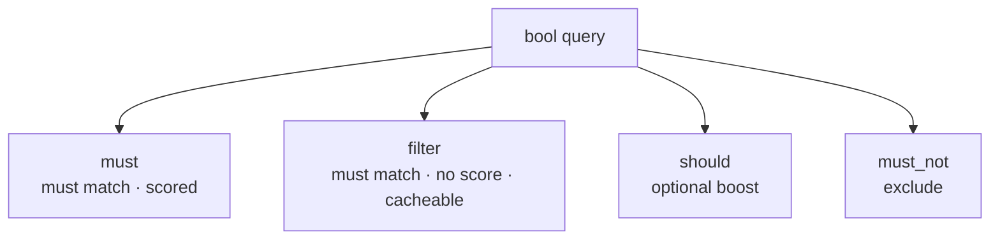

Some query types are **expensive** (fuzzy, prefix, wildcards, certain `query_string` forms, ranges on text/keyword). Clusters can disable them via `search.allow_expensive_queries` and track offenders with shard slow logs.

Adjacent languages exist for other surfaces: **query string** (URL-friendly), **DQL** (Dashboards filtering), **PPL** (piped observability-style analysis). Core application search usually starts with Query DSL.

### 8. Aggregations — analytics on the same store

Aggregations summarize matching documents (optionally after a query narrows the set). Setting `"size": 0` returns only aggregation results. Three families:

| Type | Purpose | Examples |
|------|---------|----------|
| **Metric** | Stats on numeric (and related) fields | `avg`, `sum`, `min`/`max`, `cardinality`, `percentiles` |
| **Bucket** | Group documents | `terms`, `date_histogram`, `histogram`, `range`, `filters` |
| **Pipeline** | Aggregate over other agg outputs | `avg_bucket`, `cumulative_sum`, `bucket_sort` |

**Nested aggregations** (sub-aggs under buckets) power Dashboards visualizations: e.g. `terms` on category → nested `avg` on price. Aggregations are CPU- and memory-heavier than simple searches; they lean on **doc values** (column-oriented on-disk structures) for sorting and aggregating.

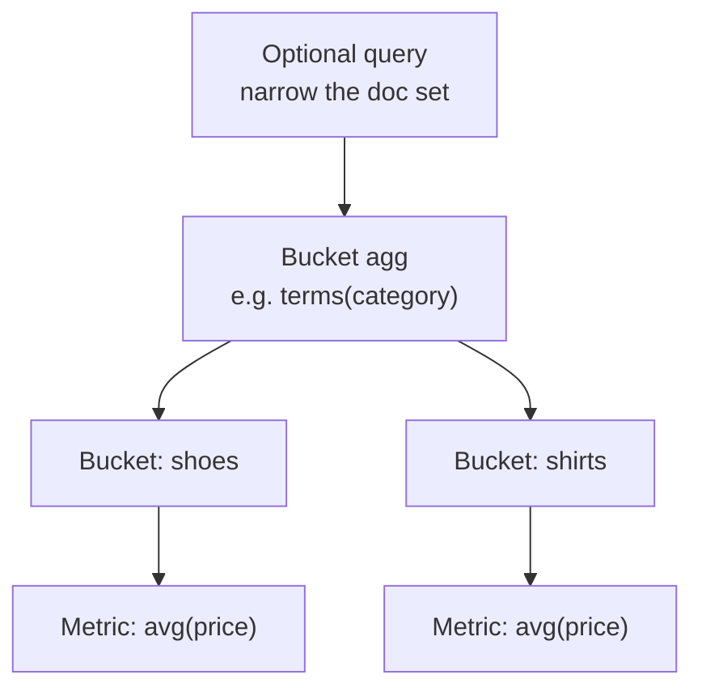

Rule: aggregate on `keyword` (or numeric/date), not on analyzed `text`.

### 9. Feature families beyond the core primitives

Built on the same document/index/shard substrate:

| Capability | What it adds |
|------------|--------------|
| **Lexical search** | Keyword/full-text queries + BM25 |
| **Vector / semantic search** | Embeddings + k-NN; meaning-aware retrieval |
| **Hybrid search** | Combine lexical and semantic ranking |
| **Ingest pipelines / Data Prepper** | Transform and enrich before or at the edge of indexing |
| **OpenSearch Dashboards** | Explore, visualize (agg-backed), Dev Tools |
| **Plugins** | Security, alerting, ISM, anomaly detection, CCR, … |

This survey stops at the primitives those features share. Cross-cluster replication and multi-Region move patterns are separate notes.

### 10. Synthesis diagram

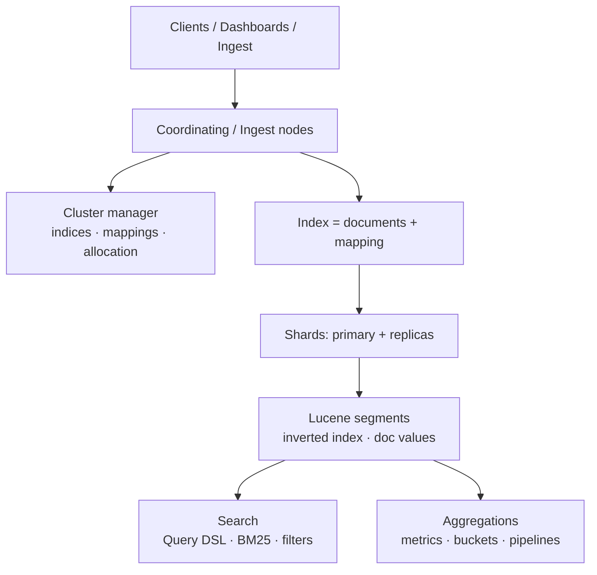

**Design thesis.** Fix the **mapping contract** (`text` vs `keyword`, multi-fields) and **shard sizing** before tuning queries. Separate **durability** (translog) from **search visibility** (refresh). Put filters in filter context; score only what users need ranked. Treat aggregations as a first-class analytics path on the same shards—not a bolt-on warehouse—while respecting their CPU/memory cost.

### 11. Conclusion

OpenSearch core is Lucene packaged as a cluster: JSON documents in mapped indices, physically partitioned into primary/replica shards on data nodes, discovered and allocated by a cluster manager, and queried through a coordinating reduce step. Lexical search is inverted-index + analysis + BM25; writes trade an explicit path through translog, refresh, flush, and merge; analytics reuse the same engine via aggregations. Mastering these basics is the prerequisite for sizing, query design, and later topics (ISM, CCR, vector search). Natural follow-ups: mappings/analyzers in depth, Query DSL scoring composition, and the write-path segment lifecycle.

---

## Review quiz

*Click a card to reveal the answer.*

:::quiz
**Q1.** Why is a shard both “a piece of an OpenSearch index” and “a full Lucene index”?
---
OpenSearch partitions a logical index into shards for distribution, but each shard is implemented as its own Lucene index (segments, inverted index, doc values). That is why shard count drives CPU/heap/file-handle cost—not only disk size.
:::

:::quiz
**Q2.** A client receives a successful index response, but an immediate search does not find the document. What usually happened?
---
The write was acknowledged after durable translog (and replica) handling, but a **refresh** has not yet made a new searchable segment visible. Search visibility lags durability unless you force or wait for refresh.
:::

:::quiz
**Q3.** When should a field be `keyword` instead of `text`, and why do multi-fields exist?
---
Use `keyword` for exact match, sorting, and aggregations (IDs, status, tags). Use `text` for analyzed full-text search. Multi-fields store both views of one string so you can search on the analyzed side and aggregate/filter on the exact side without enabling expensive `fielddata` on `text`.
:::

:::quiz
**Q4.** What is the difference between query context and filter context in Query DSL?
---
Query context scores “how well” a clause matches (BM25, etc.). Filter context only asks “does it match?”, skips scoring, and is cache-friendly—so tenant IDs, ranges, and flags belong in `filter` / filter context.
:::

:::quiz
**Q5.** Name the three aggregation families and one production pitfall with `text` fields.
---
Metric (stats), bucket (grouping), and pipeline (aggs-on-aggs). Aggregating analyzed `text` is costly and based on tokens; prefer a `keyword` multi-field (or numeric/date) instead of turning on `fielddata`.
:::

---

## Memo

—

