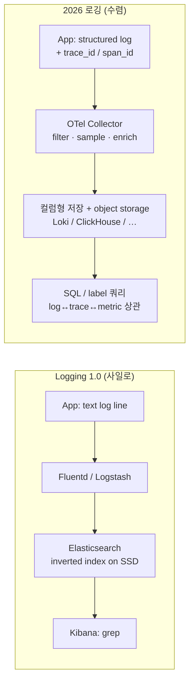
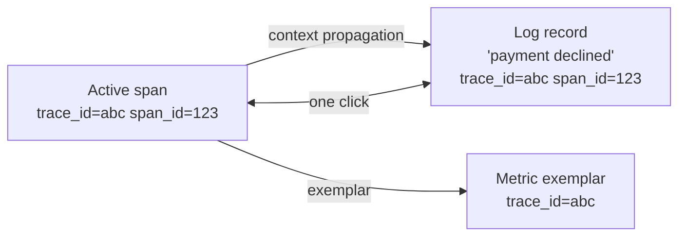
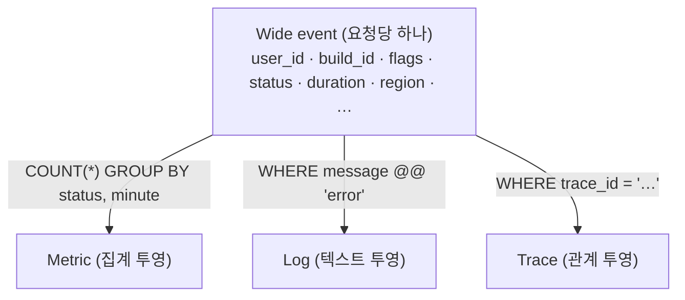
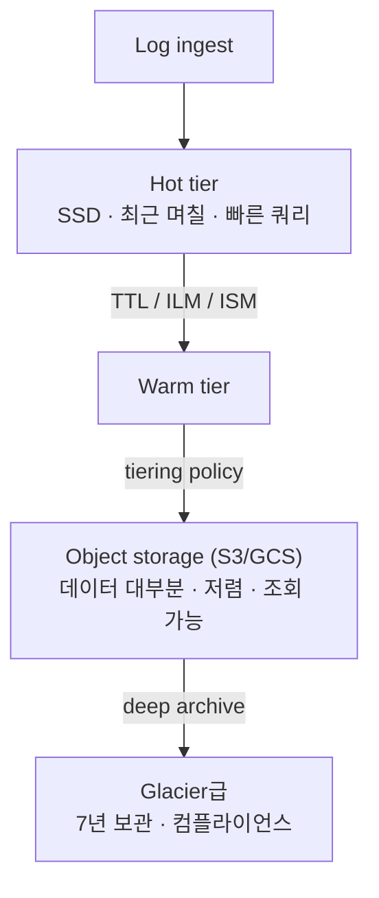
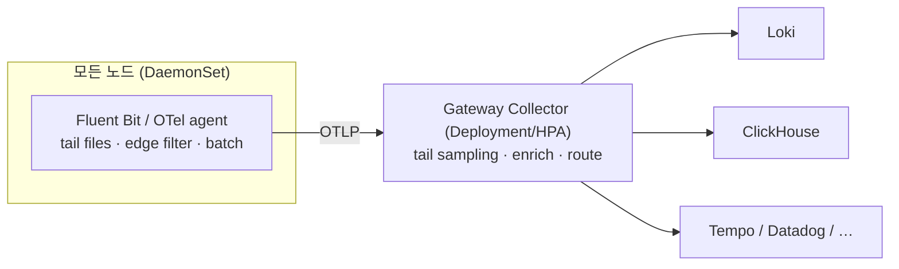
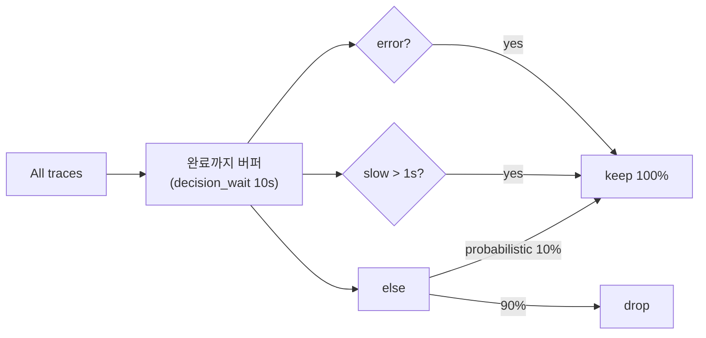
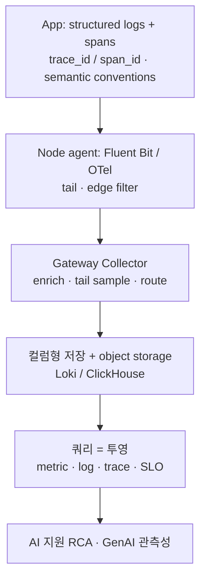

## 레퍼런스

- [OpenTelemetry 2026 Deep Dive — OTLP, Semantic Conventions, the Collector Pipeline, and Auto-Instrumentation](https://www.youngju.dev/blog/culture/2026-05-14-opentelemetry-2026-deep-dive-semantic-conventions-collector-pipeline-otlp-instrumentation.en)
- [OpenTelemetry Logs: Unified Telemetry Pipeline Architecture (2026)](https://iotdigitaltwinplm.com/opentelemetry-logs-unified-telemetry-pipeline-2026/)
- [There Is Only One Key Difference Between Observability 1.0 and 2.0 (charity.wtf)](https://charity.wtf/p/there-is-only-one-key-difference-between-observability-1-0-and-2-0)
- [Observability 2.0 vs. Observability 1.0 (Honeycomb)](https://www.honeycomb.io/blog/one-key-difference-observability1dot0-2dot0)
- [Observability 2.0 (GreptimeDB docs)](https://docs.greptime.com/user-guide/concepts/observability-2/)
- [Wide events or pillars of observability: A decision framework (Parseable)](https://www.parseable.com/blog/decision-framework-wide-events-or-traces)
- [Elasticsearch vs. OpenSearch vs. Loki vs. Quickwit vs. ClickHouse: Long-Term Log Archiving](https://blog.none.at/blog/2026/2026-05-14-es-os-loki-quickwit-clickhouse/)
- [Cost-efficient observability with ClickHouse (ClickStack) — 2026 playbook](https://clickhouse.com/resources/engineering/observability-cost-optimization-playbook)
- [OpenTelemetry Collector vs Fluent Bit (Parseable)](https://www.parseable.com/blog/otel-collector-vs-fluentbit)
- [Tail Sampling with OpenTelemetry](https://opentelemetry.io/blog/2022/tail-sampling/)
- [Observability trends for 2026: GenAI and OpenTelemetry (Elastic)](https://www.elastic.co/blog/2026-observability-trends-generative-ai-opentelemetry)

---

## 왜 이 글을 찾아봤나

로깅 시스템이 어디로 가고 있는지 정리한 리서치 노트가 필요했다. 로그를 어떻게 계측하고, 실어 나르고, 저장하고, 조회하는지 그 흐름의 최신 트렌드를 살펴봤다.

---

## 읽으면서 느낀 점

—

---

## 배운 것

### 개요

10년 동안 로깅은 이런 뜻이었다. "텍스트 한 줄을 찍고, Fluentd로 실어 보내고, 값비싼 저장소에 색인한 뒤, 장애가 터지면 grep 한다." 2026년에는 이 모델이 세 방향에서 동시에 해체되고 있다. **계측**은 OpenTelemetry로 수렴한다. 로그가 이제 일급 신호가 되어 trace, metric과 같은 wire protocol로 실려 가고 `trace_id`/`span_id`를 달고 다녀서 한 번의 클릭으로 상관 조회가 된다. **데이터 모델링**은 자유 텍스트 줄에서 *구조화* 로그로, 그리고 맨 앞단에서는 *wide event*로 옮겨간다. wide event는 작업 단위마다 하나씩 찍는, 맥락이 가득하고 카디널리티가 높은 레코드다. 이게 단일 진실 소스가 되고 metric·log·trace는 그 위에서 던지는 서로 다른 쿼리일 뿐이다("observability 2.0"). **저장**은 SSD 위 역색인 스택에서 컬럼형 엔진과 object storage로 넘어간다. 고카디널리티 데이터의 경제성은 compute와 storage를 분리해야만 성립하기 때문이다. 이 노트는 이 흐름들과 그것을 엮는 파이프라인 구조, 그리고 그 전부를 밀어붙이는 비용 압박을 훑는다.

### 1. 첫 번째 흐름 — 로그가 OpenTelemetry의 일급 신호가 됐다

가장 큰 구조 변화는 **표준화 전쟁이 끝났다**는 것이다. OpenTelemetry(OTel)가 이겼고 **OTLP**(protobuf를 gRPC/HTTP로 실어 나르는 wire protocol)가 사실상 유일한 관측성 wire 포맷이다. Tempo, Jaeger, Honeycomb, Datadog, New Relic, Dynatrace, Grafana Cloud, SigNoz가 모두 OTLP를 받는다. 벤더 전용 프로토콜은 레거시 호환용으로만 남았다.

로깅만 놓고 보면 이정표는 **OTel 로그 신호가 2024년 말 GA**됐다는 점이다. "trace는 OTel, 로그는 별도 Fluentd/Logstash 파이프라인"이던 옛 세계가 저문다. 이제 계측 모델 하나, wire protocol 하나, 프로그래밍 가능한 라우팅 계층 하나(Collector)가 trace·metric과 나란히 로그까지 처리한다.

| 항목 | 2019년 이전 | 2026년 |
|------|----------|------|
| 트레이싱 표준 | OpenTracing + OpenCensus 병존 | OpenTelemetry 단일 |
| Wire protocol | 벤더마다 하나씩 | OTLP/gRPC (4317) + OTLP/HTTP (4318) |
| 로그 | 별도 파이프라인 (Fluentd 등) | OTel 신호 하나 |
| 메트릭 | 별도 Prometheus 진영 | OTLP + Prometheus 호환 |
| 신호 | metric, log, trace | + Profiles (네 번째 신호) |

OTLP의 구조는 신호마다 반복되는 3단 트리다. 로그는 `ResourceLogs → ScopeLogs → LogRecord`, trace는 `ResourceSpans → ScopeSpans → Span`이다. 같은 서비스·라이브러리가 낸 레코드를 묶어 두는 이 구조 덕에 페이로드도 잘 압축된다.

### 2. 두 번째 흐름 — trace 컨텍스트 상관이 핵심이다

로그를 "세 번째 기둥"이라 부르는 이유는 명확하다. 로그는 나머지 둘을 안정적이고 표준적으로 가리킬 방법을 얻고 나서야 trace·metric의 *동급*이 됐다. 그 장치가 `LogRecord` 안에 실리는 `trace_id`와 `span_id`다. OTel 로그 신호의 킬러 기능은 애플리케이션이 활성 span 안에서 로그를 찍으면 이 ID들이 **자동으로 붙는다**는 것이다. 그래서 trace→log, log→trace 점프가 수작업 배선이 아니라 클릭 한 번으로 된다.

실제 마이그레이션을 좌우하는 미묘한 지점이 있다. 상관 조회는 ID가 실제로 레코드 *안에* 있어야만 된다. 두 가지가 참이어야 한다. 첫째, 애플리케이션이 로그를 찍을 때 컨텍스트에 활성 span이 있어야 한다. 둘째, trace 컨텍스트를 모르는 별도 에이전트가 긁어가는 평문 파일에 쓰는 대신 **OTel logging bridge**(또는 SDK 네이티브 appender)를 써야 한다. 평문 파일을 tail 하는 `filelog` receiver는 로그 *본문*은 살려도 애플리케이션이 애초에 쓰지 않은 `trace_id`는 복원하지 못한다. 그래서 파일 스크래핑은 첫 단계일 뿐이고 성숙한 배포는 ID가 찍는 시점에 들어가도록 파일 스크래핑에서 logging bridge로 옮겨간다.

### 3. 세 번째 흐름 — 구조화 로그, 그다음 wide event (observability 2.0)

데이터 모델링 흐름은 자유 텍스트에서 wide event까지 스펙트럼을 따라 움직인다.

| 단계 | 형태 | 쿼리 방식 | 레코드당 맥락 |
|------|------|-----------|--------------|
| 자유 텍스트 로그 | `"user 42 failed login"` | grep / 전문 검색 | 개발자가 찍은 만큼 |
| 구조화 로그 | `{user_id:42, event:"login", ok:false}` | 필드 필터 | 키 몇 개 |
| wide event | 작업 단위마다 40~100개 차원 | 아무 차원으로 `SELECT … GROUP BY` | user_id, build_id, feature flag, region, latency, … |

**구조화(JSON) 로깅**은 이제 기본 권고안이다. 고카디널리티의 맥락 있는 이벤트를 애초에 조회 가능하게 만드는 게 구조화이고, `trace_id`를 깔끔하게 주입하는 전제 조건이기도 하다.

맨 앞단은 여기서 더 나아가 **wide event**, 그리고 Charity Majors가 말하는 **observability 2.0**으로 간다. 핵심 주장은 이렇다. metric·log·trace를 위한 별도 시스템 셋을 두는 대신 **단일 진실 소스 하나 — 임의로 넓은 구조화 로그 이벤트**를 두고, 나머지 신호는 여기서 *파생*한다. wide event는 작업 단위(요청, 잡, 큐 hop)마다 한 번 찍는 맥락 풍부한 레코드로, `user_id`·`build_id`·feature flag·region·타이밍·상태 같은 메타데이터를 전부 싣는다. 흔한 구성 패턴은 **canonical log line**(요청/hop마다 요약 이벤트 하나)과 span(애플리케이션 로직 단위로 묶은 이벤트)이다.

보상은 **사후 탐색 분석**이다. 새 장애 유형이 나타나면 미리 질문을 예측해 대시보드를 만들어 두지 *않고도* `build_id`·feature flag·`user_id` 같은 임의의 고카디널리티 차원으로 잘라 본다. metric·log·trace는 별개의 데이터 타입이길 멈추고 같은 이벤트 위의 서로 다른 **투영**, 서로 다른 `SELECT`가 된다.

솔직한 트레이드오프는 실무자들이 되풀이해 말한다(예: SimpliSafe의 "은탄이 아니라 북극성" 표현). **비용 대 위력**이다. wide event는 요청당 40~100개 차원을 싣는다. 어느 단일 기둥보다도 훨씬 많은 데이터라 반론이 타당하다. 이걸 감당 가능하게 만드는 게 저장 계층이다(다음 절). observability 2.0은 스위치를 한 번에 뒤집는 교체가 아니라, 값싼 metric과 나란히 실용적으로 채택하는 방향으로 다루는 게 낫다.

### 4. 네 번째 흐름 — 저장이 컬럼형 엔진과 object storage로 간다

고카디널리티 데이터는 저장 계층이 그 형태에 맞게 설계되고 **compute와 storage가 분리**되어 데이터 대부분이 값싼 object storage(S3/GCS)에 살 수 있을 때만 감당된다. 지금 논의를 지배하는 세 구조는 이렇다.

| 시스템 | 색인 모델 | 압축 / 저장 | 강점 | 약점 |
|--------|-----------|-------------|------|------|
| **Elasticsearch / OpenSearch** | 역색인 (Lucene) | 색인이 원본의 약 3~5배로 부풀고, JVM heap은 데이터의 1/20~1/30 | 전문 검색, ILM/ISM hot→frozen 티어링 | 분석형 집계, PB 규모 비용 |
| **Loki** | 라벨 전용 색인 | 압축 청크를 object storage에 (원본의 약 1.2~1.5배) | 가장 싼 ingest + 장기 저장 | 라벨 필터 없는 전문 검색 ≈ 분산 grep |
| **ClickHouse** | 컬럼형 (전문 역색인 없음) | ZSTD + 컬럼별 코덱, 구조화 로그에서 5~10배; SQL TTL로 S3 티어링 | 분석형·고카디널리티 쿼리, log+metric+trace 통합 | 전문 substring 검색은 컬럼 스캔으로 fallback |

관통하는 통찰은 이렇다. **컬럼형 저장은 로그 데이터를 아주 잘 압축한다.** 한 컬럼의 값들을 함께 저장하니 압축기 입장에서 반복되는 `level`·`service`·`host` 문자열과 단조 증가하는 timestamp가 긴 런으로 보인다. 고카디널리티 컬럼도 컬럼별 코덱이 각 필드 분포에 맞춰 적응하니 꽤 잘 압축된다. SaaS에서는 경제적으로 무서운 wide event가 컬럼형·object storage에서는 감당 가능해지는 이유가 바로 이것이다.

경제성은 극명하다. 공개된 사이징(하루 100GB, 7년 아카이브)에서 장기 object storage 비용은 대략 Loki ≈ €3,600, ClickHouse ≈ €7,400, Elasticsearch ≈ €11,400, OpenSearch ≈ €20,400이다. Loki가 가장 싸고(전문 색인 없음), ClickHouse가 두 번째(컬럼 압축), 역색인 스택이 가장 비싸다. 실제 ELK→Loki, ELK→ClickHouse 마이그레이션은 PB 규모에서 **80~90% 비용 절감**을 보고한다. Loki의 TSDB 색인과 라벨 전용 설계, ClickHouse의 ZSTD + 오래된 데이터를 S3로 옮기는 `TTL … TO DISK/VOLUME`이 구체적인 레버다.

공짜 점심은 없다. Loki는 저장이 가장 싸지만 촘촘한 라벨 필터 없는 전문 검색은 사실상 분산 grep이다. ClickHouse는 안정적인 필드를 컬럼으로 선언해야 하고(무중단 `ALTER TABLE ADD COLUMN`과 동적 `JSON` 컬럼 타입이 완화) Lucene식 역색인이 없다. 역색인 스택은 전문 검색은 가장 좋지만 저장 비용이 가장 크다.

### 5. 다섯 번째 흐름 — 프로그래밍 가능한 파이프라인 (Collector, Fluent Bit, Vector)

앱과 저장소 사이에 **프로그래밍 가능한 라우팅 계층**이 있고, 지금 모범 사례는 **2단 구성**이다. 노드마다 가벼운 에이전트를 두고, 클러스터 전체를 모으는 무거운 gateway를 따로 둔다.

쓰이는 세 도구와 팀들이 섞어 쓰는 이유는 이렇다.

- **OpenTelemetry Collector** — 벤더 중립의 멀티 신호 허브(receiver → processor → exporter). processor로는 `memory_limiter`(안전망, 맨 앞에 와야 한다), `k8sattributes`(pod 메타데이터 자동 부착, 에이전트에 둔다), `batch`(사실상 필수), `filter`/`transform`(OTTL), `tail_sampling`(gateway 전용)이 있다. RAM은 약 30~300MB.
- **Fluent Bit** — C 기반 로그 forwarder, 유휴 시 약 5~10MB(노드당 Collector보다 약 50MB 적음). 파일 tailing, 로테이션 처리, multiline 파싱, 값싼 edge regex 필터에서 10년 성숙도. 노드 DaemonSet으로 이상적이다.
- **Vector** — Datadog의 Rust 파이프라인. 중간 계층에서 무거운 변환, VRL 파싱, dedup, 목적지별 라우팅에 강하다(초당 10만 이벤트 이상도 여유).

되풀이되는 두 프로덕션 패턴은 이렇다. **Fluent Bit이 파일을 읽고 OTLP로 Collector에 밀어 넣거나**, **Collector의 `filelogreceiver`가 파일을 직접 읽는다**. OTel 로그 receiver도 강하지만 Fluent Bit은 죽지 않았다. 컨테이너 로그 파일 tailing에서는 여전히 더 성숙하다.

### 6. 여섯 번째 흐름 — 필터링과 tail sampling로 비용 통제

볼륨(곧 청구서)이 지배적 제약이라, **잡음을 가능한 한 이른 단계에서 버리는 것**이 이제 일급 설계 목표다.

- **Edge 필터링(가장 쌈).** 노드의 Fluent Bit에서 잡음 네임스페이스, health check 스팸, 알려진 쓸모없는 패턴을 `grep`/Lua로 *네트워크를 건너기 전에* 버린다. 한 문서화된 edge 파이프라인은 sampling 로직을 Lua 필터로 그대로 옮겨 원본에서 로그 볼륨의 약 86%를 떨궜다.
- **속성 필터링(더 풍부함).** Collector에서 severity나 enrich된 속성(예: `k8s.deployment.name`)으로 OTTL을 써서 버린다. regex보다 표현력이 좋지만 CPU를 먹는다.
- **Tail sampling(trace, gateway에서).** Head sampling(SDK에서 무작위 1~10%)은 대부분의 error·느린 요청 trace를 버린다. **Tail sampling**은 trace가 완료될 때까지 span을 버퍼링한 뒤, error 100%와 느린 trace 100%를 지키고 평범한 빠른 성공만 버린다. 중요한 것을 잃지 않으면서 대역폭을 크게 줄인다. gateway의 `tail_sampling` processor는 `decision_wait`(예: 10초)와 정책들(status_code=ERROR, latency>임계, 확률적 fallback)을 쓴다. 주의: 표본 데이터는 sample rate를 붙여 백엔드가 재가중하지 않으면 집계 수치를 왜곡한다.

### 7. 일곱 번째 흐름 — 대상이자 도구로서의 AI

2026 관측성에는 GenAI 물결이 둘 흐른다. 첫째, **기록 대상으로서의 AI**다. 비결정적 LLM 에이전트는 wide event가 겨냥해 만들어진 바로 그 데이터를 뿜는다. 고카디널리티(고유 세션 수백만), 고차원(실행당 필드 수십 개), 맥락 풍부한 페이로드다. 프롬프트를 텍스트 로그에 쑤셔 넣으면 구조를 잃고 토큰 수를 미리 집계하면 디버깅에 필요한 맥락을 잃는다. OTel의 **GenAI 시맨틱 컨벤션**(거의 stable)이 이를 표준화한다. `gen_ai.system`(openai/anthropic/…), `gen_ai.request.model`, `gen_ai.usage.input_tokens`/`output_tokens`, `gen_ai.response.finish_reasons`, `gen_ai.operation.name`이다. LangChain, LlamaIndex, OpenLLMetry, Arize Phoenix가 이미 이를 따르니 LLM 비용/지연/실패가 표준 형태로 떨어진다.

둘째, **분석 도구로서의 AI**다. 벤더들은 수집된 텔레메트리 위에 AI 지원 근본 원인 분석을 얹고 있고 OTel/시맨틱 컨벤션 준수가 벤더 선택의 필수 요건이 되고 있다. AI 기능이 깨끗하고 표준적이며 고충실도 입력을 필요로 하기 때문이다. 여기 붙어서 "세 기둥"은 조용히 넷이 됐다. **continuous profiling**이 네 번째 신호로 OTLP에 들어왔고(pprof 호환 스키마), **eBPF 자동 계측**(Beyla, Coroot, Pixie)은 이제 손대지 않은 바이너리에서 SDK 없이 trace를 뽑아낸다.

### 8. 종합 — 하나의 형태, 여러 투영

**설계 명제.** trace 컨텍스트를 원천에서 실은 **구조화** 로그를 찍어라(파일 스크래핑이 아니라 logging bridge). 데이터가 이식 가능하고 AI가 분석하도록 **시맨틱 컨벤션**을 따르라. SDK에서 백엔드로 직행하지 말고 **Collector 계층**을 끼워라. 필터링/샘플링은 최대한 edge 가까이로 밀어라. 저장은 *쿼리 형태*로 골라라. 값싼 운영 로그는 라벨 색인 object storage(Loki), 고카디널리티 분석은 컬럼형(ClickHouse), 전문 검색이 지배적인 곳에만 역색인(ES/OpenSearch)이다. 감당되는 선에서 metric·log·trace를 **같은 wide event의 투영**으로 다루되, observability 2.0으로 얼마나 갈지는 교리가 아니라 비용이 정하게 하라.

### 9. 결론

2026 로깅 트렌드를 관통하는 선은 **수렴과 재투영**이다. 계측은 OpenTelemetry로, wire는 OTLP로 수렴하고 세(이제 네) 신호는 단일 wide event 진실 소스로 수렴해 나머지 전부가 그 위의 쿼리가 된다. 이를 떠받치는 기반은 고카디널리티 데이터를 값싸게 만드는 컬럼 압축 더하기 object storage, 그리고 청구서를 잡으려 공격적으로 필터·샘플링하는 프로그래밍 가능한 파이프라인이다. 로깅은 "grep 하는 텍스트"이길 멈추고 "조회하는 구조화·상관 이벤트"가 됐다. 세 번째 기둥이 마침내 trace·metric과 어깨를 나란히 한 것이다. 자연스러운 후속은 Collector 파이프라인 심화 운영, wide event/컬럼형 저장 내부, Loki vs ClickHouse 경제성 계산, 그리고 GenAI/LLM 관측성이다.

---

## 복습 퀴즈

*카드를 클릭하면 답이 열립니다.*

:::quiz
**Q1.** 상관 조회가 목표일 때, 평문 로그 파일을 tail 하는 것보다 OTel *logging bridge*가 나은 이유는?
---
상관은 `trace_id`/`span_id`가 로그 레코드 *안에* 있어야 된다. logging bridge(또는 SDK 네이티브 appender)는 활성 span의 컨텍스트를 읽어 찍는 시점에 그 ID를 쓴다. 평문 파일을 긁는 `filelog` receiver는 본문은 살려도 애플리케이션이 애초에 쓰지 않은 `trace_id`는 복원하지 못한다. 그래서 파일 스크래핑은 마이그레이션 첫 단계일 뿐이다.
:::

:::quiz
**Q2.** observability 2.0에서 metric·log·trace는 wide event와 어떤 관계인가?
---
별개의 데이터 타입이 아니라 같은 wide 구조화 이벤트 위의 서로 다른 **투영**(쿼리)이다. metric ≈ `COUNT(*) … GROUP BY status, minute`(집계), log ≈ `WHERE message @@ 'error'`(텍스트), trace ≈ `WHERE trace_id = '…'`(관계)다. 진실 소스는 하나, 신호는 파생.
:::

:::quiz
**Q3.** 컬럼형 저장(ClickHouse)이 로그를 이토록 잘 압축하는 이유와 Loki·Elasticsearch 대비 트레이드오프는?
---
컬럼형은 한 컬럼의 값을 함께 두니 압축기가 반복되는 `level`/`service`/`host`와 단조 timestamp를 긴 런으로 본다. 컬럼별 코덱(ZSTD)이 필드마다 적응해 구조화 로그에서 약 5~10배가 나온다. 트레이드오프: ClickHouse는 Lucene식 역색인이 없어 전문 검색이 컬럼 스캔으로 fallback한다. Loki는 저장이 가장 싸지만 라벨 필터 없는 전문 검색은 분산 grep이다. Elasticsearch는 전문 검색이 가장 좋지만 저장이 약 3~5배 부풀고 규모에서 가장 비싸다.
:::

:::quiz
**Q4.** tail sampling이 head sampling이 놓치는 무엇을 잡고, 파이프라인 어디서 도는가?
---
head sampling은 SDK에서 무작위로(예: 1~10%) 결정하니 대부분의 error·느린 요청 trace를 버린다. tail sampling은 **gateway Collector**에서 돌며 trace가 완료될 때까지 span을 버퍼링(`decision_wait`)한 뒤 error 100%와 느린 trace 100%를 지키고 평범한 빠른 성공은 버린다. 흥미로운 trace를 잃지 않으면서 대역폭을 크게 아낀다. (주의: 표본 데이터는 재가중용 sample rate를 붙이지 않으면 집계를 왜곡한다.)
:::

:::quiz
**Q5.** 비결정적 LLM/AI 에이전트가 고전 로그나 사전 집계 metric보다 wide event에 잘 맞는 이유는?
---
LLM 에이전트는 고카디널리티(고유 세션 수백만), 고차원(호출당 필드 수십 개), 맥락 풍부한 데이터를 낸다. 프롬프트를 텍스트 로그에 넣으면 구조를 잃고, 토큰 metric을 미리 집계하면 비결정성을 디버깅할 맥락을 잃는다. wide event는 OTel `gen_ai.*` 시맨틱 컨벤션(`gen_ai.usage.input_tokens` 등)과 함께 그런 시스템이 요구하는 원본 그대로의, 구조화된, 사후 조회 가능한 세부를 보존한다.
:::

---

## 메모

—
