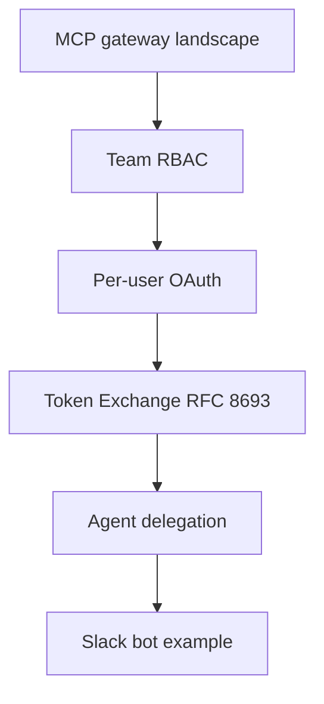

> 원문: [Microsoft MCP Gateway](https://github.com/microsoft/mcp-gateway) · [MCP Authorization spec](https://modelcontextprotocol.io/specification/2025-03-26/basic/authorization) · [RFC 8693 Token Exchange](https://datatracker.ietf.org/doc/html/rfc8693) · [Cursor MCP docs](https://cursor.com/docs/mcp) · 대화형 학습 세션 (2026-07-09)

---

## 왜 이 글을 찾아봤나

MCP gateway를 한 번 파고들기 시작했는데, 질문이 여섯 개로 이어졌다.

1. **MCP gateway 현상태는?** — 생태계 스냅샷, 활발한 프로젝트, Cursor와의 관계.
2. **회사에서 gateway 하나를 여러 팀이 쓸 때 권한은?** — 팀마다 다른 MCP server/tool 접근.
3. **Per-user OAuth는 어떻게 가능?** — RBAC는 이해했는데, upstream을 공용 bot account가 아닌 실제 user로 호출하는 메커니즘.
4. **Token exchange를 더 깊게** — Per-user OAuth → RFC 8693, wire format, passthrough 금지 이유.
5. **호출자가 agent/service면?** — Slack bot, background worker가 **요청한 user 권한**으로 동작하게.
6. **Slack bot 예시** — Alice/Bob이 같은 bot을 써도 Jira/Slack 호출은 각자 credential.

흐름: **생태계 조사 → 팀 RBAC → user OAuth → token exchange → agent delegation → Slack bot 구현**.

---

## 읽으면서 느낀 점

오늘 배운 내용이 진짜 많고 읽은 내용도 진짜 많다. 그래서 누락 없이 잘 정리해 달라고 했다.

---

## 배운 것

### 1. MCP gateway 현황 (2026)

**MCP gateway**는 Cursor, Claude Desktop, Slack bot 같은 MCP client와 upstream MCP server 사이에 얹는 중간 계층이다. 인증·RBAC·audit·session routing·credential 관리를 한곳에서 처리한다.

```
MCP Client → Gateway (단일 URL) → MCP Server A / B / C
```

| 프로젝트 | Stars (대략) | 최근 활동 | 특징 |
|---------|-------------|----------|------|
| Bifrost | ~6.4k | 2026-07 | LLM + MCP gateway, Go binary |
| Docker MCP Gateway | ~1.5k | 2026-07 | CLI 플러그인, 로컬/컨테이너 |
| IBM ContextForge | ~4k | 2026-07 | MCP/A2A/REST 통합 gateway |
| Obot | ~879 | 2026-07 | Hosting + registry + gateway |
| **Microsoft MCP Gateway** | ~733 | 2026-06 | K8s/Azure native, Entra ID |
| MetaMCP | ~2.5k | 2026-06 | Docker aggregator |

상용: MintMCP, TrueFoundry, Lunar MCPX, Kong, AWS Bedrock AgentCore Gateway 등. 추적 프로젝트 40+개, 아직 consolidation 전, 단일 표준 없음.

**Microsoft MCP Gateway** (대표 오픈소스):

- Dual plane: **Data Plane**(MCP 라우팅) + **Control Plane**(adapter/tool CRUD)
- 주요 endpoint: `POST /adapters/{name}/mcp`, `POST /mcp` (tool gateway router)
- K8s session-aware stateful routing
- Entra ID app roles (`mcp.admin`, `mcp.engineer`, …) + adapter `requiredRoles`
- Agents & Sessions (Preview): opt-in, Azure Foundry 필요
- 2026년 6월: built-in tool·nested agent authorization 보안 강화
- GitHub Release 없음 — `main`에서 배포

**Cursor** 자체 MCP gateway 없음. Enterprise: MCP Allowlist, per-server tool/network policy, Team MCP distribution, Hooks. 파트너(MintMCP, Runlayer)가 gateway/broker 제공. Cloud Agents는 MCP execution hooks 미지원.

**이 워크스페이스** (`research-notes`)에는 MCP gateway 구현 없음. Cloud Agent MCP: `cursor-cloud`(ready), `Notion`(needsAuth).

---

### 2. 팀 RBAC — 팀마다 다른 접근

핵심: **server 단위가 아니라 tool 단위** 권한. "Jira MCP 접근"은 너무 넓다 — `search_issues`(read)와 `delete_project`(admin)를 분리해야 한다.

3계층 모델:

| 계층 | 역할 | 예시 |
|------|------|------|
| 인증 (Who) | identity 확인 | SSO, API key, M2M JWT |
| 역할 매핑 (What role) | IdP group → gateway role | `eng-team` → `engineering` |
| 도구 정책 (Which tools) | role → tool groups | `engineering` → reads + writes |

**Enforcement 2곳:**

1. **Discovery** — `tools/list`에서 허용 tool만 반환
2. **Execution** — `tools/call` 권한 없으면 403 (upstream 전 호출 차단)

**Default deny** — 명시 허용 외 전부 차단.

#### Gateway별 RBAC

| Gateway | RBAC |
|---------|------|
| **Microsoft MCP Gateway** | Entra app roles → adapter `requiredRoles`. Read: creator, `mcp.admin`, matching role. Write: creator 또는 `mcp.admin`. adapter 단위에 강함. |
| **Lunar MCPX** | YAML ACL: `toolGroups`(reads/writes/admin) + `consumers`. default `base: block`. API key/consumer tag. |
| **Bifrost** | role별 virtual key + tool allow-list. deny-by-default. |
| **MintMCP** | SCIM RBAC + Virtual MCP Bundles. tool-level allowlist. IdP group ↔ bundle. |

#### Enterprise rollout

1. IdP group = 팀
2. Tool group: reads / writes / admin
3. Role → tool group 매트릭스
4. (선택) 팀별 endpoint 분리 (`/engineering`, `/support`)
5. Credential: per-user OAuth + service account 병행

**ABAC:** argument 제약 — 예: `zendesk.reply_to_ticket`에서 `public: false`만.

---

### 3. Per-user OAuth

Jira, Slack, Snowflake 같은 upstream API는 **각 user credential**로 호출한다. 공용 service account로 돌리지 않는다.

#### gateway 없을 때 (문제)

```
모든 engineer → Gateway → Jira (bot-account)
CURRENT_USER() = BOT — per-user RLS·audit·revoke 불가
```

#### Per-user OAuth

```
Alice → Gateway → Jira (Alice token)
Bob   → Gateway → Jira (Bob token)
```

#### 메커니즘: OAuth broker + token vault

1. User OAuth consent 1회
2. Gateway vault: `{user → {jira_token, slack_token, refresh, exp}}`
3. tool call마다 user token inject — Cursor는 upstream token 모름
4. Gateway가 refresh 처리

Cursor remote MCP OAuth callback: `https://www.cursor.com/agents/mcp/oauth/callback`, `cursor://anysphere.cursor-mcp/oauth/callback`

#### stdio MCP server

로컬 stdio + env var(`GITHUB_PERSONAL_ACCESS_TOKEN`). Gateway가 stdio→remote 변환 + OAuth brokering(MintMCP, mcp-auth-gateway): user별 process spawn, Unix socket/env inject.

#### Credential 저장 비교

| 방식 | 위치 | 용도 |
|------|------|------|
| Service account | Gateway vault (공용) | org-wide read-only |
| Per-user OAuth | Gateway vault (user×service) | Jira, Slack, Snowflake RLS |
| PAT in Vault | HashiCorp Vault | OAuth 없는 legacy API |
| Client-side | Cursor keychain | dev/local |

Gateway RBAC + upstream user credential **둘 다** 적용.

---

### 4. Token Exchange (RFC 8693)

한 token을 **다른 audience·narrow scope** token으로 교환. user identity(`sub`) 유지.

#### Token passthrough가 안 되는 이유

MCP spec §7.3: MCP server마다 별도 Resource Server·audience. Passthrough는 위반.

| 문제 | 결과 |
|------|------|
| Confused deputy | gateway token을 다른 service에 replay |
| Audience collapse | gateway용 token이 upstream에서 수용 |
| Audit 파괴 | proxy 결정이 upstream log에 안 보임 |

**규칙:** token은 mint된 trust boundary 하나만 crossing. 매 hop마다 새 token.

#### RFC 8693 요청

```http
POST /token HTTP/1.1
Host: idp.company.com
Content-Type: application/x-www-form-urlencoded
Authorization: Basic <gateway_client_id:secret>

grant_type=urn:ietf:params:oauth:grant-type:token-exchange
&subject_token=<Alice gateway JWT>
&subject_token_type=urn:ietf:params:oauth:token-type:jwt
&audience=https://myaccount.snowflakecomputing.com
&requested_token_type=urn:ietf:params:oauth:token-type:access_token
&scope=snowflake:query
```

#### 응답 payload

```json
{
  "iss": "https://idp.company.com",
  "aud": "https://myaccount.snowflakecomputing.com",
  "sub": "alice@company.com",
  "scope": "snowflake:query",
  "exp": 1735689600
}
```

| Claim | 입력 | 출력 |
|-------|------|------|
| `aud` | `mcp-gateway` | `snowflake` |
| `sub` | `alice@company.com` | 동일 |
| `scope` | broad | narrow |

#### 3패턴 비교

| 패턴 | Downstream identity | MCP spec | Production |
|------|---------------------|----------|------------|
| Service account | BOT | — | user RLS 없음 |
| Passthrough | User (동일 token) | 위반 | 금지 |
| Token exchange | User (새 token) | 준수 | 권장 |

#### Gateway 3-stage pipeline

```
Stage 1 — Authenticate: JWT signature, aud=gateway
Stage 2 — Authorize: tool required scope → 없으면 403
Stage 3 — Exchange: RFC 8693 → downstream token → upstream
```

Stage 3는 **user-impersonation** platform만. org-wide app-key는 bypass.

#### tool call마다 다른 exchange

- `jira.search_issues` → Jira JWT (`scope=jira:read`)
- `snowflake.run_query` → Snowflake JWT (`scope=query`)
- `github.create_pr` → GitHub JWT (`scope=repo:write`)

Jira server가 token 탈취해도 Snowflake에 replay 불가(`aud` mismatch).

#### Impersonation vs Delegation (RFC 8693 §1.1)

| Mode | JWT | Audit |
|------|-----|-------|
| **Impersonation** | user 그 자체, actor trace 없음 | downstream은 user만 봄 |
| **Delegation** | `sub`=user + `act`=actor (multi-hop은 nested) | chain 전체 기록 |

MCP·agent 쪽은 audit 때문에 **delegation** 쪽이 낫다. 로그에 "agent X가 user Y 대신 gateway Z를 거쳤다"가 남는다.

#### Actor + Subject (OBO)

```
subject_token = Alice JWT (권한 주체)
actor_token   = Gateway/Agent JWT (교환 수행자)
→ output: sub=Alice, act=Gateway/Agent
```

IdP actor/subject app modeling 필요(Okta, Entra) — 1회 tenant setup.

#### Tool auth mode (fail-closed)

| Mode | User context | 예 |
|------|--------------|-----|
| `user-impersonation` | 필수, 없으면 fail | `snowflake.run_query` |
| `service-account` | 불필요 | internal metrics |
| `app-key` | 불필요 | legacy public API |

user-delegation에서 service account **silent fallback 금지**.

#### Production 주의

- IdP RFC 8693 + gateway exchange client trust
- Downstream trust (Snowflake External OAuth 등)
- Audience binding (RFC 8707)
- Exchange cache key 오류 = cross-user token mixup (최악의 bug)

---

### 5. Agent/service + user 권한

MCP **client가 agent**(Slack bot, background worker)일 때:

```
같은 agent 코드, invocation마다 다른 user 권한
Alice → upstream = Alice
Bob   → upstream = Bob
```

#### Agent용 JWT claim

```json
{
  "sub": "alice@company.com",
  "aud": "https://jira-mcp.company.com",
  "scope": "jira:read",
  "act": {
    "sub": "slack-bot",
    "iss": "https://idp.company.com"
  }
}
```

| Claim | 의미 |
|-------|------|
| `sub` | 권한 주체 — Alice |
| `act` | 실행자 — slack-bot |
| Audit | `user=alice, agent=slack-bot, tool=jira.create_issue` |

#### User context 전달 3방식

| 패턴 | 전달 | 적합 |
|------|------|------|
| **A. Interactive** | User JWT in request | Cursor, chat UI |
| **B. Delegated token at invoke** | workflow 시작 시 short-lived token | background/scheduled |
| **C. OBO at gateway** | Agent M2M + `X-On-Behalf-Of: Alice JWT` | enterprise multi-agent |

#### OBO flow

```
1. Agent M2M JWT 검증
2. Alice JWT 검증
3. IdP may_act: 이 agent가 이 user 대신 가능?
4. Exchange: subject=Alice, actor=Agent
5. Audit: user + agent + tool
```

#### Multi-hop chain

```
Alice → Oncall Agent → Investigation Agent → Gateway → Jira
```

hop마다 exchange + scope narrowing. Uber(2026), AWS AgentCore Identity(2026) 문서화.

#### IdP `may_act` 예

```
agent:oncall-bot → group "oncall-engineers", scopes: [jira:read], max: 4h
agent:hr-assistant → group "hr-team", scopes: [workday:read]
agent:deploy-bot → DENY
```

#### MCP EMA (2026)

IdP에서 agent-user-server policy central 관리. User SSO 1회, per-server consent 없이 ID-JAG assertion. Okta(XAA), Anthropic, VS Code, Atlassian 등.

#### Anti-patterns

| 하지 말 것 | 이유 |
|-----------|------|
| Agent에 user token 영구 저장 | leak = full access |
| user context 없을 때 service account fallback | escalation |
| user JWT downstream passthrough | confused deputy |
| agent identity 없이 호출 | audit 불가 |
| 모든 agent에 `may_act: *` | compromise = all users |

---

### 6. Slack bot — per-user permissions

**목표:** `@bot Jira 티켓 만들어줘`가 **요청자** Jira/Slack 권한으로 실행.

#### Bot token만으론 불가

Slack bot token(`xoxb-`) = 모든 user에게 동일 identity.

#### Architecture

```
Alice/Bob → Slack → Bot Service (agent M2M) → MCP Gateway (vault) → Slack/Jira MCP → Upstream
```

#### 1회 연결 (`/bot-link`)

1. `/bot-link` 실행
2. Browser OAuth: Slack user scope + Jira (SSO)
3. Vault: `alice@company.com → {slack_user_token, jira_token, refresh}`
4. "연결 완료 — 내 권한으로 요청합니다"

Slack app **user scope** 필요:

```yaml
oauth_config:
  scopes:
    bot: [chat:write, app_mentions:read]
    user: [channels:read, channels:write, users:read]
```

#### 요청 처리

```
1. Alice @bot "ENG에 공지 올려줘"
2. event.user = U_ALICE
3. Bot → Gateway: Bearer {bot M2M}, X-Slack-User-Id: U_ALICE
4. U_ALICE → alice@company.com → vault tokens
5. slack.post_message → Alice user token
6. Alice가 ENG write 가능할 때만 성공
7. Bot reply는 thread (bot token OK)
```

Bob 동일 요청 → Bob token → ENG write 없으면 403.

#### Tool별 token

| Tool | Token | 이유 |
|------|-------|------|
| `slack.post_message` | Alice **user token** | Alice channel 권한 |
| `jira.create_issue` | Alice **Jira token** | Alice project 권한 |
| Bot thread reply | Bot token | UI만 |

**원칙:** upstream = user token, bot↔user UI = bot token.

#### Slack user_id → corporate identity

Enterprise Grid+SSO, OAuth link 시 저장, `users.info` lookup.

#### Security

- Bot Service는 user token 안 봄 — Gateway vault만
- event.user ↔ token owner 일치 검증
- Gateway refresh, 만료 시 re-link
- Bot M2M만 탈취 → user context 없으면 upstream 불가
- Audit: `{slack_user, email, agent, tool, timestamp, result}`

#### 미연결 user

```
Bot: /bot-link 먼저 실행해서 Slack·Jira 연결해주세요.
```

---

### 궁금증 map (세션 arc)



| Step | 질문 | 핵심 답 |
|------|------|---------|
| 1 | Gateway 현상태? | 40+ projects, Cursor 자체 gateway 없음 |
| 2 | 팀별 권한? | tool-level RBAC, default deny, IdP groups |
| 3 | Per-user OAuth? | broker + vault, consent 1회, call마다 inject |
| 4 | Token exchange? | RFC 8693, passthrough 금지, act+sub |
| 5 | Agent + user? | OBO, may_act, fail-closed |
| 6 | Slack bot? | event.user → vault → user token |

---

### Reference links

| Resource | URL |
|----------|-----|
| Microsoft MCP Gateway | https://github.com/microsoft/mcp-gateway |
| Microsoft MCP Gateway docs | https://microsoft.github.io/mcp-gateway/ |
| Entra app roles | https://github.com/microsoft/mcp-gateway/blob/main/docs/entra-app-roles.md |
| MCP Authorization spec | https://modelcontextprotocol.io/specification/2025-03-26/basic/authorization |
| RFC 8693 | https://datatracker.ietf.org/doc/html/rfc8693 |
| Cursor MCP docs | https://cursor.com/docs/mcp |
| Lunar MCPX ACL | https://docs.lunar.dev/mcpx/access_control_list/ |
| Solo agentgateway OBO | https://docs.solo.io/agentgateway/latest/mcp/token-exchange/obo/delegation/ |
| Red Hat MCP Gateway auth | https://developers.redhat.com/articles/2025/12/12/advanced-authentication-authorization-mcp-gateway |
| MCP Auth explained | http://blog.dwornikowski.com/posts/mcp-auth-explained/ |
| Token exchange in production | https://ultrathinksolutions.com/the-signal/mcp-gateway-authentication/ |

---

## 메모

오늘 세션 전체를 한 장에 모았다. landscape, 팀 RBAC, per-user OAuth, RFC 8693, agent OBO, Slack bot까지. 읽은 것 빠짐없이 적어 두려고.
